# EduBench 深度分析报告

> 数据来源：`results_merge_enriched.jsonl`（5536 条记录，含分类标签增强）  
> 测试集：`results_test.jsonl`（2218 条记录，基于 (question, answer, metric) 三元组精确匹配 test.json）  
> 训练集：`results_train.jsonl`（3318 条记录，JSONL 中未出现在 test.json 的回答）  
> 分析日期：2025-04  
> 分析脚本：`edubench_comprehensive_analysis.py`（基础分析）、`category_analysis.py`（分类维度分析）、`recompute_s5_v2.py`（测试集评估器分析）  
> 拆分脚本：`split_train_test_v4.py`（三级匹配：精确→空白归一化→仅保留字母数字/CJK）  
> 产物目录：`deep_analysis_outputs/`
> 
> **重要说明**：EduBenchEvaluator 的训练过程使用了 JSONL 数据的一部分，因此第五节"自动评估能力分析"全部基于测试集（2218 条）进行，以确保评估器对比的公平性。测试集的拆分严格基于 (question, answer, metric) 三元组匹配——只有当 JSONL 中某条记录的题目、回答、评估维度三者同时出现在 test.json 中，才被归入测试集。test.json 中有 601 条记录的回答在 JSONL 中不存在（覆盖 245 个唯一问题），已单独导出至 `test_unmatched_in_jsonl.json`。第一至四节的数据分布和生成模型分析仍基于全量 5536 条数据。

---

## 分析角度

我已经在上一轮读取了分析报告的全部内容，现在让我先看一下原始数据的结构，以便更好地结合数据特征给出分析角度。
现在我对数据集的完整结构有了清晰的认识。这是一个围绕教育场景中大语言模型能力评测的多维度数据集（EduBench），包含 5536 条记录、9 个教育任务、5 个生成模型、5 个自动评估器 + 3 个人类评审、12 个评估维度，并覆盖了 41 个学科和 6 个学制级别。以下是 10 个可以在 empirical study 论文中深入分析的角度：

---

**角度 1：LLM-as-Judge 在教育场景中的系统性失灵——低分盲区问题（The Low-Score Blind Spot of Automated Evaluators）**

这是你数据中最具冲击力的发现之一。所有自动评估器在人类打 1-2 分时偏差高达 2-3.5 分，gpt-4o 在 1 分段准确率为 0%。这可以作为一个独立的 research question 来深入探讨：自动评估器为何在低分区间系统性失效？你可以通过校准曲线分析、分数段条件概率分解、以及对低分样本的 case study 来揭示失效的机制（例如评估器被"形式规范性"迷惑而忽略了内容层面的错误）。这对"LLM-as-Judge"这一热门范式构成了重要的 empirical caveat。

---

**角度 2：教育任务的"区分度-评估难度"二维框架（A Discriminability × Evaluability Framework for Educational Tasks）**

报告中已经绘制了 discriminability vs. evaluability 的散点图，这可以发展为一个正式的分析框架。personalized_content_creation 处于"高区分度 + 低评估难度"的理想象限，而 automatic_grading 和 problem_solving 处于"中区分度 + 高评估难度"的危险象限。你可以对 9 个任务进行二维聚类分析，提出一套教育基准任务的选择与设计原则，论证什么样的任务最适合作为 benchmark 的核心任务——这是 benchmark design methodology 层面的贡献。

---

**角度 3：模型参数规模与教育任务表现的脱耦现象（Parameter Scale Does Not Predict Educational Performance）**

qwen2.5-7b 和 qwen2.5-14b 在成对 Wilcoxon 检验中 p=0.170，在统计上不可区分——14B 模型在教育任务上并没有比 7B 做得更好。这与"scaling law"的一般预期相悖。你可以进一步按任务、学科、维度做 subgroup 分析，看两者的差异是否在某些子空间中变得显著（比如在 Elementary School 中 7B 更优，在 Middle School 中 14B 更优），进而讨论教育场景中模型能力的决定因素是什么——是参数量、训练数据分布、还是 alignment 策略。

---

**角度 4：学科作为被低估的隐变量——Subject 对评分方差的贡献超过 Task（Subject as an Underappreciated Confound in Educational Benchmarks）**

方差分解显示 subject 的 η²（0.046）接近 model（0.059），远高于 task（0.025）。这意味着"教的是什么学科"几乎和"用的哪个模型"一样重要，但现有教育 benchmark 论文几乎从未将学科作为独立分析维度。你可以围绕 Business Administration 这个极端案例（均分 3.686，所有模型在此学科均表现低迷且无显著差异）展开深入讨论，探究学科特异性如何影响 LLM 的教育辅助能力。

---

**角度 5：跨语言教育能力的不对称性——任务级别的语言效应反转（Language Effect Reversal Across Educational Tasks）**

整体上英文优于中文约 0.114 分，但细分到任务级别，方向发生了反转：psychological_support 的英中差异高达 +0.608，而 idea_provision、error_correction、question_generation 中文反而更高。结合学制级别的交互（Elementary School 中英文差异仅 0.013，Middle School 高达 0.299），你可以构建一个 Task × Language × Education Level 的三维交互分析，揭示语言效应在教育场景中的非平凡结构，挑战"英文数据总是更好"的简单假设。

---

**角度 6：学制效应的非线性"U 型"模式——模型能力与题目难度的匹配关系（The Non-Monotonic Education Level Effect: A Sweet Spot Hypothesis）**

High School 效应最高（+0.183），Middle School 最低（−0.136），既不是线性递减也不是单调的。你可以提出一个"能力-难度匹配假说"：当前 LLM 的教育辅助能力存在一个"甜区"（sweet spot），高中阶段的内容复杂度刚好落在模型能力范围内且有明确评价标准，而初中阶段的特殊题型（实验探究、文言文等）和本科阶段的开放性要求分别从不同方向偏离了这个甜区。通过 Bootstrap 置信区间和学制×学科交互分析来论证这一假说。

---

**角度 7：评估维度的能力层级结构——从基础事实到高阶思维的阶梯式衰减（A Hierarchical Competency Model: From Factual Accuracy to Higher-Order Thinking）**

12 个统一维度的效应值呈现出清晰的层级：Basic Factual Accuracy（+0.394）和 Content Relevance（+0.295）处于顶层，而 Reasoning Process Rigor（−0.537）和 Higher-Order Thinking（−0.451）处于底层。你可以将这 12 个维度映射到 Bloom's Taxonomy 或类似的教育学能力分类框架上，通过因子分析或聚类分析验证"LLM 的教育能力符合从低阶到高阶逐层衰减的阶梯模式"这一假说，并量化每个层级的衰减幅度。这是教育学理论与 NLP 评测的一个有价值的交叉点。

---

**角度 8：学科自适应的评估器组合策略——超越单一评估器的范式（Subject-Adaptive Evaluator Ensembles: Beyond One-Size-Fits-All）**

一个非常有实践价值的发现：在 Mathematics 低分检测上，deepseek-r1（60.5%）远超 EduBenchEvaluator（16.3%），但在 Business Administration 和 Computer Science 等学科中 EduBenchEvaluator 远优于所有 LLM judge。这暗示最优评估策略不是选择"最好的单一评估器"，而是构建学科自适应的评估器组合。你可以用数据做一个 oracle ensemble 实验，在每个学科选择该学科上 MAE 最低的评估器，计算组合后的整体 MAE 改善幅度，并进一步探讨基于学科特征（推理密集度、标准答案明确度等）自动选择评估器的可行路径。

---

**角度 9：deepseek-r1 的优势边界与反转条件——任务-学科交互下的模型排名不稳定性（When the Best Model Fails: Rank Reversal Patterns of deepseek-r1）**

deepseek-r1 在 9 个任务中 8 个排第一，在 41 个学科绝大多数中排第一。但正是那些"例外"最有研究价值：problem_solving 中 qwen-max 反超（4.22 vs 4.03），Business Administration 中 qwen2.5-14b 微幅领先，Psychology 中 qwen2.5-14b 反超 deepseek-v3。你可以系统性地检测所有"排名反转"发生的条件，通过 logistic regression 或 decision tree 建模预测在什么任务×学科×维度组合下 deepseek-r1 不再是最优模型，从而揭示"全面领先型模型"的能力边界和领先优势的结构性特征。

---

**角度 10：人类评审者间一致性与自动评估器偏差的关联——评审异质性如何放大自动评估误差（Inter-Rater Disagreement as a Predictor of Automated Evaluation Error）**

数据中有三位人类评审的独立打分，可以计算每条记录的 human inter-rater agreement（如 Krippendorff's alpha 或人类评审方差）。一个有趣的假说是：人类评审自身分歧越大的样本，自动评估器的误差也越大——因为"连人类都难以达成共识"的评判自然对机器也更具挑战性。你可以以人类评审方差为自变量、各评估器 MAE 为因变量做回归分析，按任务和维度分层，量化这种"评审不确定性传导效应"的大小，并讨论在人类自身 disagreement 较高的维度（如 Higher-Order Thinking）上，自动评估器的 MAE 是否有结构性上界。

---

这 10 个角度覆盖了论文的不同核心贡献类型：角度 1、8 偏向实践方法论贡献（evaluator design），角度 2、4 偏向 benchmark 设计方法论，角度 3、9 偏向模型能力的 empirical finding，角度 5、6 偏向教育场景的特殊性发现，角度 7 偏向教育学理论连接，角度 10 偏向评估可靠性的元分析。你可以根据目标会议/期刊的侧重点选择 3-5 个角度作为论文的核心 research questions。

## 补充角度

好问题。让我重新审视一下数据集的结构特征，看看有没有报告中未充分挖掘、但数据本身能支撑的角度。
看到原始数据后，我注意到了几个报告中完全没有触及但数据本身能够支撑的分析角度。以下是我认为值得补充的方向：

---

**一、评分标准（Rubric）的信息利用率问题**

每条记录的 `levels` 字段包含了完整的 5 级评分标准文本（rubric），但报告只关注了最终的数字评分，从未分析评分标准本身。一个很有价值的角度是：自动评估器是否真正"读懂"了 rubric？你可以对比同一维度在不同任务中的 rubric 措辞差异，看当 rubric 描述更具体（如"JSON 格式是否规范"）时评估器准确率是否高于描述更抽象（如"是否促进高阶思维"）时。这本质上是在回答一个关于 rubric faithfulness 的问题——评估器的表现是被 rubric 的可操作性所调节的，而非仅仅由任务或维度本身决定。这可以通过对 rubric 文本的复杂度指标（句长、抽象名词占比等）与评估器 MAE 做相关分析来实现。

---

**二、"天花板压缩效应"与有效区分力的丧失**

报告反复提到分数偏高，但没有正式量化这种天花板效应对统计推断的后果。当 82.84% 的 deepseek-r1 样本得分 ≥4.5 时，分数的有效方差被严重压缩。你可以计算每个模型的"有效变异系数"（去除天花板样本后的方差），论证在 5 分制下高分区间的区分力实际上是崩溃的——两个"都得了 5 分"的回答之间的质量差异被完全抹平了。这引出一个方法论贡献：教育 benchmark 是否应该采用更细粒度的评分量表（比如 7 分制或 10 分制），或者引入 forced ranking 来解决天花板效应。你可以用数据做一个模拟实验，把 5 分样本随机拆分为 5/6/7，看是否能恢复更多的模型间区分度。

---

**三、"同题跨模型"设计下的 Question-Level 难度建模（Item Response Theory）**

数据集的核心设计优势是"每道题被 5 个模型回答"，这天然满足 Item Response Theory（IRT）的数据要求。报告提到了 question 的 ICC=0.191，但从未真正做 IRT 建模。你可以将每道题视为一个 item，将每个模型视为一个 examinee，拟合 2PL 或 GRM 模型，估计每道题的难度参数和区分度参数，同时估计每个模型的"教育能力"潜在特质值（theta）。这不仅能给出比简单均分更精确的模型排名，还能识别出"信息量最大的题目"——即那些最能拉开模型差距的题目。IRT 视角在 NLP benchmark 分析中已有先例（如 Lalor et al., 2019），但在教育场景 benchmark 中尚未被系统应用。

---

**四、评估器之间的"共识-分歧"结构分析**

报告分别分析了每个评估器的准确率，但没有分析评估器"之间"的一致性结构。5 个自动评估器在哪些样本上达成共识？在哪些样本上严重分歧？你可以计算每条记录上 5 个评估器评分的标准差，定义"高共识样本"（σ < 0.5）和"高分歧样本"（σ > 1.5），然后分析这两组样本在任务、学科、维度、人类评分上的分布差异。一个可能的发现是：高分歧样本恰好集中在人类打 3 分的"灰色地带"，即评估器在模棱两可的样本上各执己见。这为"何时可以信任自动评估、何时必须引入人工"提供了实操判据。

---

**五、answer 文本特征与评分的关系——"形式 vs 内容"之争**

原始数据中 `answer` 字段包含了模型生成的完整回答文本。报告完全基于数值评分分析，从未利用文本本身。你可以提取 answer 的表层特征（长度、JSON 格式规范度、列表项数量、是否提及学生姓名等），分析这些特征与人类评分和自动评估器评分之间的相关性差异。一个极有可能的发现是：自动评估器的评分与回答长度的相关性显著高于人类评审——也就是说，评估器在一定程度上把"写得多"等同于"写得好"。如果能证实这一点，就为低分盲区问题找到了一个具体的机制解释（形式特征对评估器的干扰），这比单纯报告校准偏差更有说服力。

---

**六、教育场景中的 metadata-score 不匹配（Label Leakage 检测）**

我在原始数据中注意到一个耐人寻味的现象：第 4000 行是一道"以下哪个词语的意思是形容一个人非常高兴？"这样的小学级别词汇题，但它的 `education_level` 标注为"博士"，`subject` 标注为"理论经济学"。这种 metadata 与实际题目内容的不匹配可能不是孤例。你可以系统性地检测数据集中"题目实际难度与标注学制级别不一致"的样本比例，分析这种不匹配对评分的影响——当一道简单题被标注为高学制时，人类评审和自动评估器是否会因为"预期难度"的锚定效应而给出不同的分数？这既是数据质量的 audit，也可以引出关于评估者认知偏差的讨论。

---

**七、评估维度之间的冗余性与独立性——维度到底需要几个？**

数据集用了 12 个统一维度，但这些维度之间是否存在高度共线性？如果 Basic Factual Accuracy 和 Domain Knowledge Accuracy 的评分在大多数样本上高度相关（r > 0.9），那保留两个维度就是冗余的。你可以对 12 个维度的人类评分做 PCA 或因子分析，看有效维度的数量。如果发现 3-4 个潜在因子就能解释 80%+ 的方差，这就为简化教育评估框架提供了 empirical 依据，也对未来 benchmark 的维度设计有直接指导意义。进一步可以对比人类评分和自动评估器评分的因子结构是否一致——如果不一致，说明评估器"理解"的质量维度和人类不同。

---

这七个角度和之前的 10 个在性质上有明确区分：角度一到三偏向方法论层面的深挖（rubric、评分量表设计、IRT），角度四和五利用了报告完全未触及的数据字段（评估器间结构、answer 文本），角度六和七则是对数据质量和评估框架本身的反思性分析。特别是角度五（文本特征分析）和角度三（IRT 建模），在 reviewer 看来会是比较有新意的技术贡献，建议优先考虑。

## 〇、分类标签概览

增强后的数据集为每条记录附加了学科（subject）、学制级别（education_level）、语言（language）、题型（question_type）、知识点（knowledge_point）和焦虑级别（anxiety_level）六个分类标签。各标签的覆盖情况如下：

| 标签字段 | 非空记录数 | 覆盖率(%) | 唯一取值数 |
|----------|-----------|----------|-----------|
| language | 5536 | 100.0 | 2 |
| subject_unified | 5536 | 100.0 | 25 |
| education_level_unified | 5536 | 100.0 | 6 |
| question_type_EN | 5536 | 100.0 | 9 |
| knowledge_point | 1430 | 25.8 | 43 |
| anxiety_level | 549 | 9.9 | 7 |

language、subject、education_level 和 question_type 四个字段实现了 100% 覆盖，可作为全量交叉分析的基础。knowledge_point 仅覆盖 25.8% 的记录（主要集中在 automatic_grading 和 problem_solving 等有明确知识点的任务），anxiety_level 仅覆盖 9.9%（仅出现在 psychological_support 任务中），这两个字段的分析需注意样本代表性。

**中英文标签统一映射**：由于中文数据使用中文标签、英文数据使用英文标签，所有分析均已进行统一映射。学制级别映射为：小学→Elementary School、初中→Middle School、高中→High School、大学→Undergraduate、硕士→Master、博士→PhD。学科映射为：数学→Mathematics、化学→Chemistry、物理/物理学→Physics、历史/历史学→History、生物/生物学→Biology、心理学→Psychology、计算机科学→Computer Science、基础医学→Basic Medicine、文学与艺术→Literature and Art、水产养殖→Aquaculture、公共管理学→Public Administration、商业管理学→Business Administration、临床医学→Clinical Medicine、体育教育学→Physical Education、军事学→Military Science、作物科学→Crop Science、普通教育学→General Pedagogy、理论经济学→Theoretical Economics、应用经济学→Applied Economics、法学→Law、地理→Geography、英语→English、语文→Chinese。映射后 education_level_unified 共 6 个级别，subject_unified 共 25 个学科。数据文件中已新增 `education_level_unified` 和 `subject_unified` 两个字段。

**评估维度（metric）统一映射**：原始数据中每个评估维度同时存在中英文两种表示（共 24 个取值），所有分析已将中文维度名称统一映射为英文。12 对映射关系为：指令遵循与任务完成→Instruction Following & Task Completion、内容相关性与范围控制→Content Relevance & Scope Control、基础事实准确性→Basic Factual Accuracy、场景要素融合度→Scenario Element Integration、清晰易懂与表达启发→Clarity, Simplicity & Inspiration、促进高阶思维与能力发展→Higher-Order Thinking & Skill Development、推理过程严谨性→Reasoning Process Rigor、个性化适应与学习支持→Personalization, Adaptation & Learning Support、领域知识专业性→Domain Knowledge Accuracy、激励引导与积极反馈→Motivation, Guidance & Positive Feedback、角色与口吻一致性→Role & Tone Consistency、错误识别与纠正精确性→Error Identification & Correction Precision。映射后 metric 共 12 个统一维度。

---

## 一、样本结构分析

本节旨在全面梳理数据集中任务、题目、维度、语言、生成模型和评估器的分布特征，并从学科、学制级别和题型维度进行交叉描述，为后续分析奠定基础。

### 1.1 任务分布

数据集包含 9 个教育任务，各任务的样本量存在明显不均衡。

| 任务 | 样本数 | 占比(%) | 唯一题目数 | 维度数 |
|------|--------|---------|-----------|--------|
| idea_provision | 863 | 15.59 | 22 | 8 |
| teaching_material_generation | 770 | 13.91 | 22 | 7 |
| error_correction | 750 | 13.55 | 22 | 7 |
| question_generation | 660 | 11.92 | 22 | 6 |
| automatic_grading | 628 | 11.34 | 22 | 6 |
| psychological_support | 549 | 9.92 | 21 | 5 |
| personalized_learning_support | 542 | 9.79 | 22 | 5 |
| problem_solving | 444 | 8.02 | 23 | 4 |
| personalized_content_creation | 330 | 5.96 | 22 | 3 |

最大任务（idea_provision, 863条）是最小任务（personalized_content_creation, 330条）的 2.6 倍。每个任务内部包含 21—23 个唯一题目，每个题目被 5 个模型回答并在多个维度上评分，这种"同题跨模型"的设计保证了控制变量比较的可行性。不同任务覆盖的评估维度数也不同（中英文统一映射后），从 3（personalized_content_creation）到 8（idea_provision），共 12 个统一维度，这意味着跨任务的维度简单拼合会引入偏差。

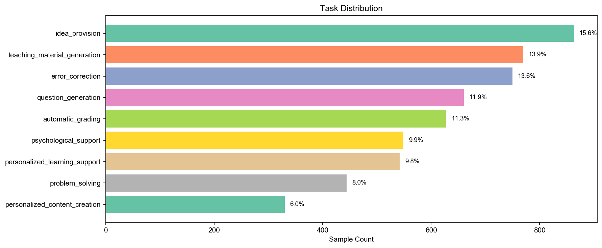

### 1.2 生成模型分布

5 个生成模型的样本分布非常接近均衡，每个模型约占 20%：deepseek-r1（1119条, 20.2%）、qwen-max（1110条, 20.1%）、qwen2.5-7b-instruct（1108条, 20.0%）、deepseek-v3（1100条, 19.9%）、qwen2.5-14b-instruct（1099条, 19.9%）。这种近乎等量的分布使得模型间的直接比较无需额外加权校正。

### 1.3 语言分布

每个任务内部的中英文样本大致平衡，但并非完全对称。

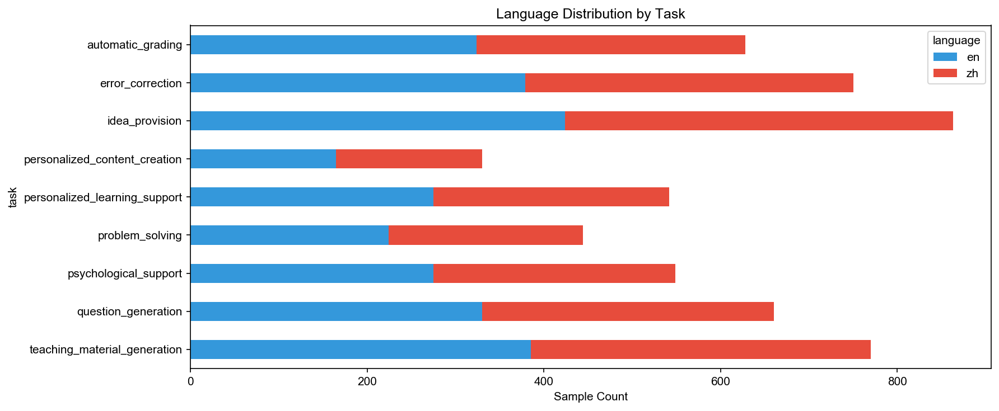

### 1.4 评分分布特征

评估器之间的打分分布差异非常显著，这是理解后续所有分析的关键前置发现。

| 评估器 | 1分(%) | 2分(%) | 3分(%) | 4分(%) | 5分(%) |
|--------|--------|--------|--------|--------|--------|
| human_1 | 1.52 | 2.04 | 9.52 | 44.94 | 41.98 |
| human_2 | 1.55 | 2.58 | 9.95 | 30.46 | 55.46 |
| human_3 | 1.64 | 1.82 | 10.03 | 32.55 | 53.96 |
| EduBenchEvaluator | 0.61 | 0.58 | 2.44 | 30.60 | 65.77 |
| deepseek-r1 | 0.83 | 2.85 | 4.97 | 19.78 | 71.48 |
| deepseek-v3 | 1.27 | 0.18 | 1.36 | 20.88 | 75.49 |
| gpt-4o | 0.26 | 0.35 | 1.46 | 18.92 | 78.93 |
| qwq-plus | 0.97 | 1.91 | 3.67 | 16.80 | 76.63 |

三位人类评审在 1—3 分区间的合计比例约为 13—14%，而 gpt-4o 仅有 2.07%，差距高达 6 倍以上。所有自动评估器都呈现出严重的"右偏"分布——压倒性地偏好给 5 分。这种分布偏斜直接导致了后续观察到的系统性高估现象。

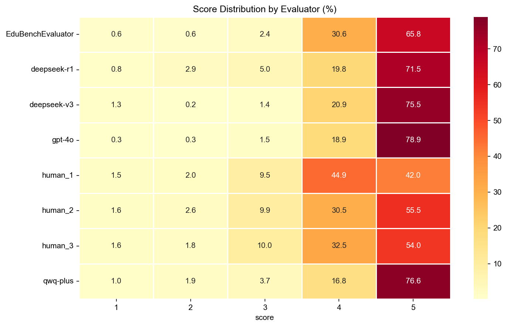

### 1.5 学科分布

统一映射后共 25 个学科，样本量差异悬殊。排名前 10 的学科覆盖了约 72% 的数据：

| 学科 | 样本数 | 人类均分 | 覆盖任务数 | 唯一题目数 |
|------|--------|---------|-----------|-----------|
| History | 368 | 4.243 | 8 | 14 |
| Physics | 353 | 4.373 | 7 | 14 |
| Mathematics | 323 | 4.276 | 7 | 11 |
| Basic Medicine | 309 | 4.182 | 5 | 10 |
| Chemistry | 290 | 4.396 | 7 | 10 |
| Literature and Art | 287 | 4.399 | 8 | 9 |
| Aquaculture | 285 | 4.426 | 6 | 10 |
| Biology | 282 | 4.305 | 8 | 11 |
| Public Administration | 275 | 4.476 | 6 | 9 |
| Psychology | 274 | 4.332 | 5 | 9 |

History 样本量最大（368条），人类均分为 4.243。中英文统一映射后，原来的 51 个学科合并为 25 个（如"数学"与"Mathematics"合并、"物理"与"物理学"与"Physics"合并等），各学科样本量相比映射前有明显增加。尾部的 Business Administration 均分显著低于其他学科，这个异常值在后续分析中值得特别关注。

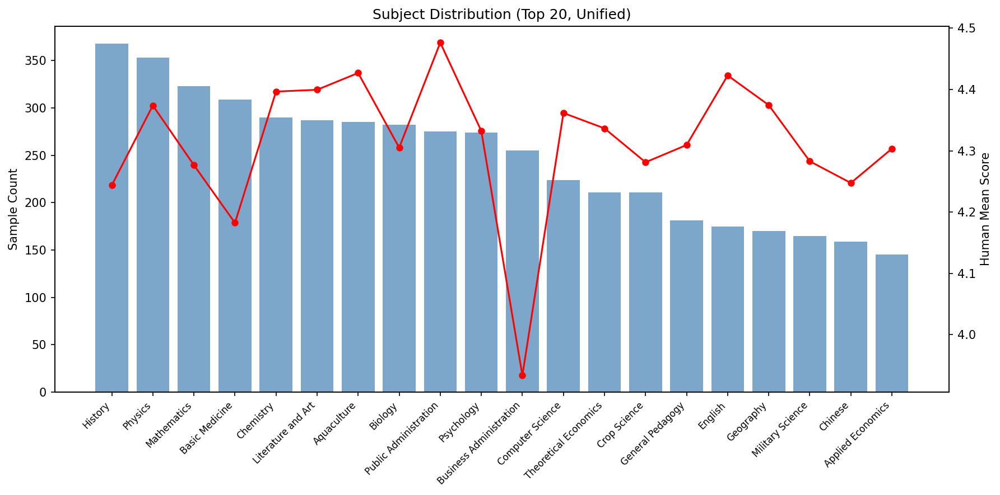

### 1.6 学制级别分布

数据集覆盖了从 Elementary School 到 PhD 的 6 个学制级别，但分布极不均衡：

| 学制级别 | 样本数 | 人类均分 | 覆盖任务数 | 唯一题目数 |
|----------|--------|---------|-----------|-----------|
| Elementary School | 474 | 4.399 | 9 | 18 |
| Middle School | 294 | 4.180 | 8 | 11 |
| High School | 451 | 4.499 | 7 | 15 |
| Undergraduate | 1575 | 4.235 | 9 | 57 |
| Master | 1583 | 4.344 | 9 | 53 |
| PhD | 1159 | 4.317 | 9 | 43 |

高等教育阶段（Undergraduate + Master + PhD）合计 4317 条，占总量的 78%。Middle School 样本最少（294条），且人类均分最低（4.180）。有趣的是，High School（4.499）的人类均分是所有级别中最高的，高于 Elementary School（4.399），这可能反映了 High School 阶段题目内容与模型训练语料分布的高度匹配。

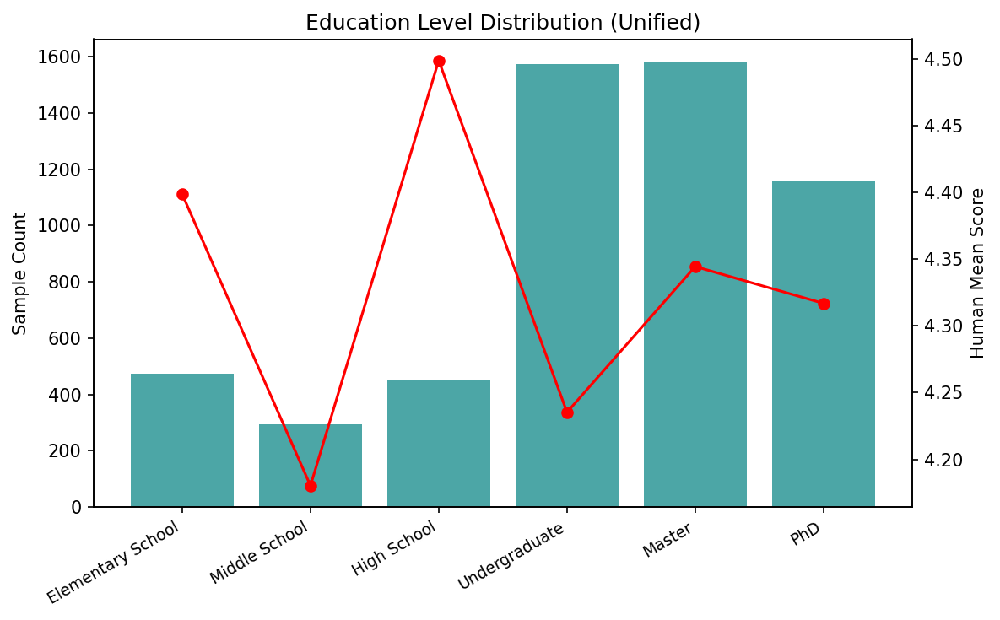

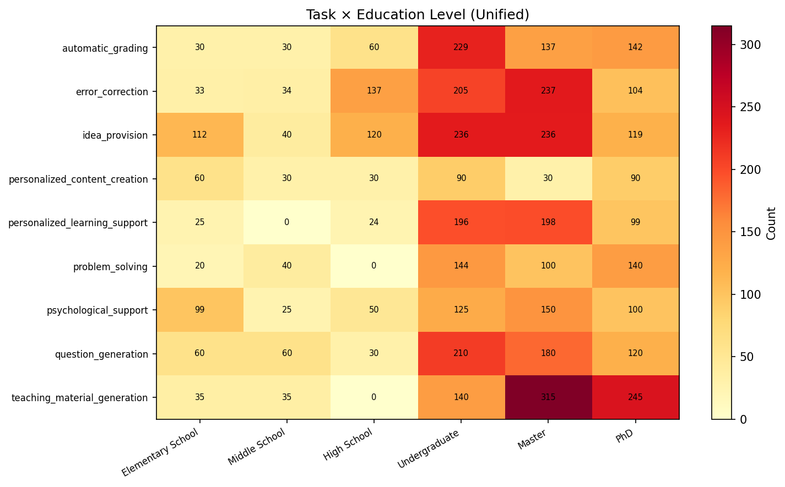

任务×学制交叉热力图显示，并非所有任务都覆盖了所有学制级别。例如 Middle School 在多个任务中的样本量都偏少，这在后续交叉分析中需要注意样本量差异可能带来的估计不稳定性。

### 1.7 题型分布

题型（question_type）按任务自然划分为 9 种类型，每种题型与一个特定任务高度对应：

| 题型 | 样本数 | 人类均分 | 关联任务数 |
|------|--------|---------|-----------|
| helper（辅助设计类） | 863 | 4.404 | 1 |
| material（教材生成类） | 770 | 4.405 | 1 |
| error_correct（纠错类） | 750 | 4.363 | 1 |
| question_gen（出题类） | 660 | 4.389 | 1 |
| judge（判分类） | 632 | 4.104 | 2 |
| mood（心理辅导类） | 549 | 4.409 | 1 |
| design（个性化设计类） | 542 | 4.262 | 1 |
| Q&A（问答解题类） | 440 | 4.052 | 1 |
| student_profile（画像建议类） | 330 | 4.319 | 1 |

judge 和 Q&A 两种题型的人类均分最低（4.104 和 4.052），与 automatic_grading 和 problem_solving 两个任务的低均分特征完全吻合。题型分类在本数据集中与任务高度耦合，因此后续分析以学科和学制级别的交叉为主。

### 1.8 小结

样本结构整体上是一个设计合理但并不完全均衡的多因子嵌套数据集。任务间样本量差异较大，不同任务覆盖的维度组合不同，中英文样本基本对半但不完全对称。学科分布以理工科（Mathematics、Chemistry、Physics）为主，学制以高等教育阶段为主。后续分析必须在任务层和维度层分别进行，同时关注学科和学制的交叉效应，避免简单汇总导致的 Simpson 悖论。

---

## 二、任务机制分析

本节聚焦两个核心问题：哪些任务和维度更容易让生成模型拉开差距（模型区分度），哪些更容易让自动评估器"看不准"（评估难度）。

### 2.1 任务层模型区分度

以各任务上不同生成模型人类均分的标准差（model_spread）作为区分度指标：

| 任务 | 人类均分 | 模型间σ | 模型间极差 | 最优模型 | 最弱模型 |
|------|---------|---------|-----------|---------|---------|
| personalized_content_creation | 4.319 | 0.442 | 1.015 | deepseek-r1 (4.955) | deepseek-v3 (3.939) |
| personalized_learning_support | 4.262 | 0.371 | 0.956 | deepseek-r1 (4.855) | qwen2.5-14b (3.898) |
| psychological_support | 4.409 | 0.298 | 0.821 | deepseek-r1 (4.855) | qwen2.5-14b (4.033) |
| automatic_grading | 4.100 | 0.263 | 0.719 | deepseek-r1 (4.409) | qwen2.5-7b (3.691) |
| teaching_material_generation | 4.405 | 0.215 | 0.537 | deepseek-r1 (4.753) | qwen2.5-14b (4.217) |
| question_generation | 4.389 | 0.205 | 0.505 | deepseek-r1 (4.639) | qwen2.5-7b (4.134) |
| problem_solving | 4.058 | 0.192 | 0.470 | qwen-max (4.220) | qwen2.5-7b (3.750) |
| idea_provision | 4.404 | 0.190 | 0.523 | deepseek-r1 (4.669) | qwen2.5-14b (4.145) |
| error_correction | 4.363 | 0.156 | 0.416 | deepseek-r1 (4.607) | qwen2.5-14b (4.191) |

**核心发现**：personalized_content_creation 的区分度最高（σ=0.442, 极差=1.015），deepseek-r1 在该任务上接近满分（4.955），而 deepseek-v3 只有 3.939，差距超过 1 分。这说明"根据学生画像生成个性化内容"是当前最能拉开模型差距的任务类型。紧随其后的是 personalized_learning_support（σ=0.371）和 psychological_support（σ=0.298），这三个任务的共同特点是都要求模型深度融合情境要素、维持个性化语气和提供针对性建议——这些是教育场景特有的高阶能力需求。

相反，error_correction（σ=0.156）和 idea_provision（σ=0.190）的区分度最低，模型间差异有限。这类任务更偏向"格式化输出+基本知识调用"，对模型上限的要求相对较低。

值得注意的是，problem_solving 是唯一一个 deepseek-r1 不是最优模型的任务，qwen-max 以 4.220 超过了 deepseek-r1 的 4.027。这提示在结构化解题任务中，模型的优劣排序会发生反转。

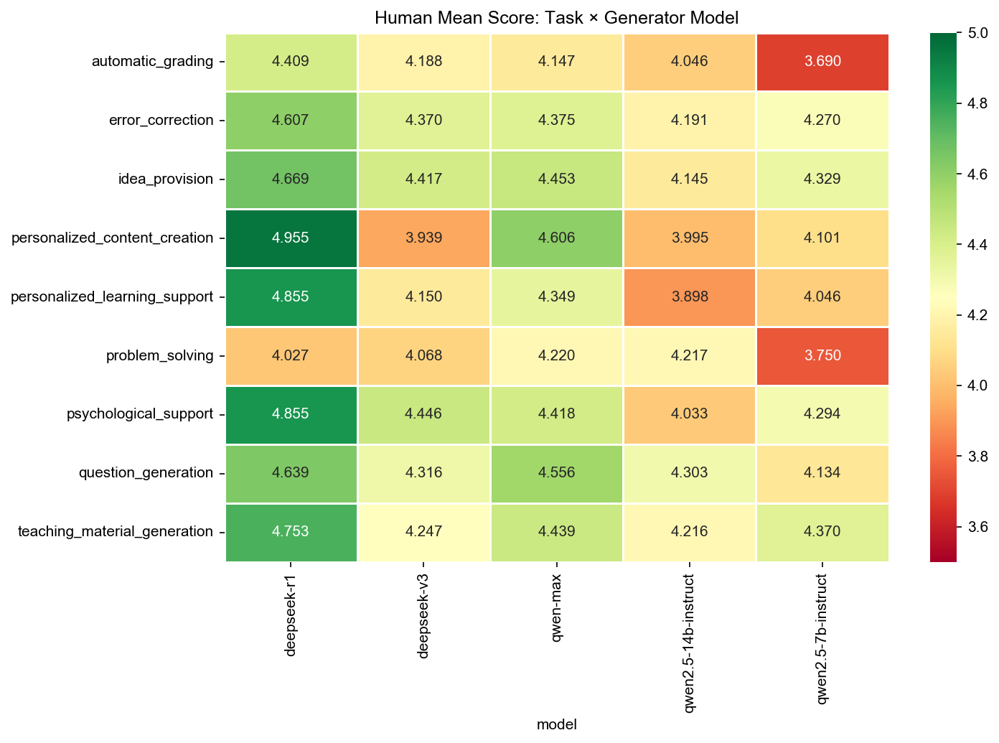

### 2.2 维度层模型区分度

以各维度上不同模型人类均分的标准差排序（中英文维度已统一映射），区分度最高的维度：

| 维度 | 样本数 | 人类均分 | 模型间σ | 模型间极差 |
|------|--------|---------|---------|-----------|
| Personalization, Adaptation & Learning Support | 329 | 4.206 | 0.382 | 1.116 |
| Higher-Order Thinking & Skill Development | 428 | 3.865 | 0.311 | 0.818 |
| Scenario Element Integration | 547 | 4.197 | 0.282 | 0.836 |
| Role & Tone Consistency | 220 | 4.418 | 0.224 | 0.659 |
| Motivation, Guidance & Positive Feedback | 315 | 3.947 | 0.220 | 0.637 |

区分度最低的维度包括 Basic Factual Accuracy（σ=0.056）和 Content Relevance & Scope Control（σ=0.126）。这些"基础型"维度各模型已能稳定达到高水平，难以产生区分。

**深层原因分析**：区分度最高的维度聚焦于教育场景专属的高阶能力。Personalization, Adaptation & Learning Support（个性化适应与学习支持）要求模型真正理解学生特征并据此调整建议，而非套用模板；Scenario Element Integration（场景要素融合度）要求把学生档案、学科背景、对话历史（dialog history）等要素深度编织进回答；Higher-Order Thinking & Skill Development（促进高阶思维与能力发展）要求回答不仅正确，还要启发思考。这些能力需要的不是简单的知识检索，而是推理、共情和教学策略的综合运用——这正是当前语言模型能力分化最明显的领域。

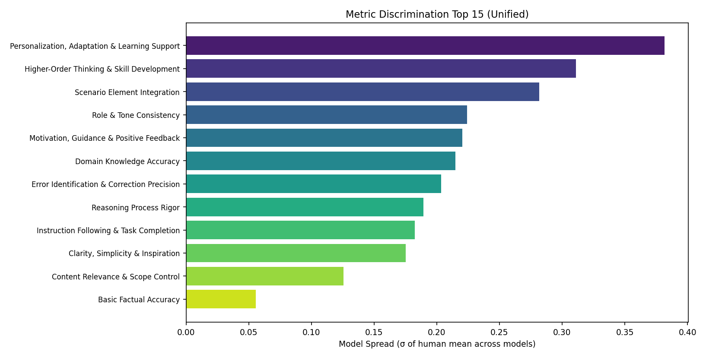

### 2.3 评估难度分析

哪些任务对自动评估器最具挑战性？以各评估器在每个任务上的平均 MAE 衡量：

| 任务 | EduBench | deepseek-r1 | deepseek-v3 | gpt-4o | qwq-plus |
|------|----------|-------------|-------------|--------|----------|
| automatic_grading | 0.806 | 0.895 | 1.183 | 0.791 | 0.871 |
| problem_solving | 0.610 | 0.935 | 0.972 | 0.900 | 1.010 |
| question_generation | 0.455 | 0.473 | 0.432 | 0.461 | 0.467 |
| idea_provision | 0.425 | 0.541 | 0.457 | 0.466 | 0.560 |
| error_correction | 0.389 | 0.523 | 0.516 | 0.532 | 0.493 |
| teaching_material | 0.360 | 0.532 | 0.549 | 0.511 | 0.498 |
| personalized_learning | 0.338 | 0.594 | 0.606 | 0.682 | 0.608 |
| psychological_support | 0.310 | 0.496 | 0.489 | 0.552 | 0.541 |
| personalized_content | 0.300 | 0.594 | 0.594 | 0.617 | 0.577 |

**automatic_grading 和 problem_solving 是评估最难的两个任务**，所有评估器在这两个任务上的 MAE 都远高于其他任务。其中 deepseek-v3 在 automatic_grading 上的 MAE 高达 1.183，qwq-plus 在 problem_solving 上达到 1.010。

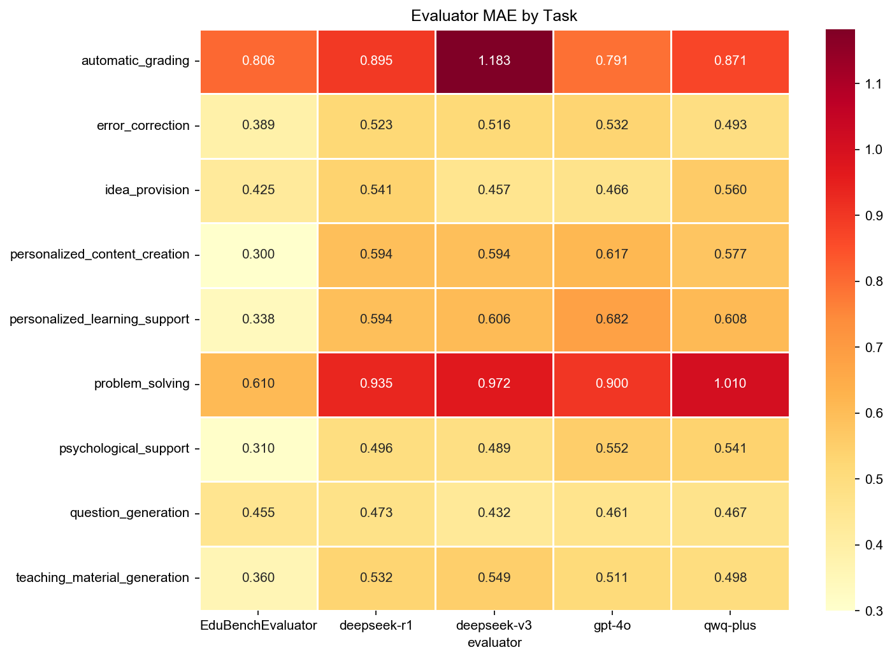

**原因剖析**：

automatic_grading 之所以特别难评，是因为该任务本身是一个"元评估"——模型需要根据标准答案判断学生回答的对错程度、给出评分细则和反馈。评估器不仅要判断回答的表面质量，还要验证模型的判分逻辑是否正确，这需要同时理解题目、标准答案、学生答案和评分规范四层信息。当模型输出的评分格式（JSON）虽然规范但评分依据存在微妙错误时，自动评估器往往会被形式上的规范性迷惑。

problem_solving 的评估难点在于"推理链验证"。一个 Mathematics 或 Law 解题过程可能形式上完整，但中间步骤存在逻辑跳跃或前提引用错误，这种深层瑕疵需要评估器真正理解推理过程才能捕捉。对比发现，LLM judge（MAE 0.9—1.0）在这类任务上比 EduBenchEvaluator（MAE 0.61）差距更大，说明通用大模型的"看似理解"并不等于真正的评估能力。

相反，psychological_support 和 personalized_content_creation 是最容易评估的任务（EduBenchEvaluator MAE 仅 0.31 和 0.30），因为这类任务的评价标准更侧重表面可观测特征（语气是否温和、是否提到学生姓名、是否给出具体建议），模式匹配即可实现较高的评估准确性。

### 2.4 区分度 vs 评估难度的关系

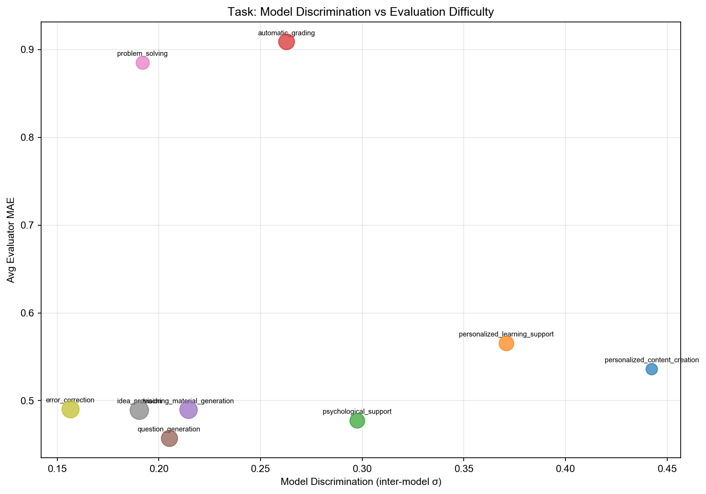

将两个维度叠加后可以发现：personalized_content_creation 呈现"高区分度 + 低评估难度"的理想组合，说明该任务既能拉开模型水平，自动评估器又能较准确地衡量这种差异。而 automatic_grading 和 problem_solving 则处于"中等区分度 + 高评估难度"区域，说明虽然这两个任务在一定程度上区分了模型，但自动评估器给出的评价本身就不够可靠，需要结合人类判断审慎解读。

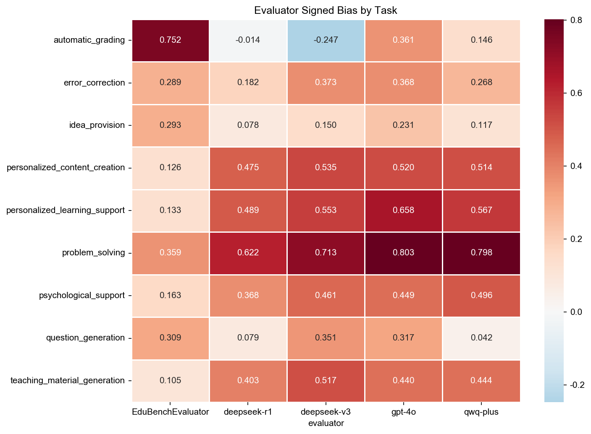

### 2.5 学科层模型区分度

不同学科对模型的区分效果差异显著：

| 学科 | 样本数 | 人类均分 | 模型间σ | 模型间极差 | 最优模型 | 最弱模型 |
|------|--------|---------|---------|-----------|---------|---------|
| General Pedagogy | 181 | 4.3094 | 0.3267 | 0.9772 | deepseek-r1 (4.8198) | qwen2.5-14b-instruct (3.8426) |
| Chinese | 159 | 4.2474 | 0.3141 | 0.9062 | deepseek-r1 (4.7708) | qwen2.5-7b-instruct (3.8646) |
| English | 175 | 4.4229 | 0.3111 | 0.9534 | deepseek-r1 (4.9630) | qwen2.5-14b-instruct (4.0095) |
| Automation | 90 | 4.4185 | 0.3076 | 0.7963 | qwen-max (4.7963) | qwen2.5-7b-instruct (4.0000) |
| Clinical Medicine | 133 | 4.2907 | 0.2608 | 0.7037 | deepseek-r1 (4.7778) | qwen2.5-14b-instruct (4.0741) |
| Crop Science | 211 | 4.2812 | 0.0829 | 0.2222 | deepseek-v3 (4.3968) | qwen2.5-7b-instruct (4.1746) |

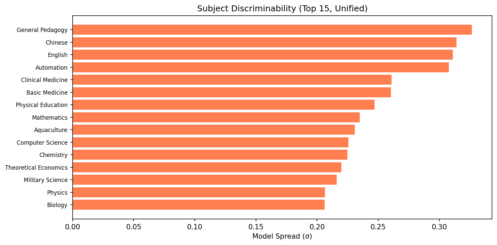

**General Pedagogy的区分度最高**（σ=0.3267, 极差=0.9772），deepseek-r1 与 qwen2.5-14b-instruct 之间差距显著，说明该领域专业知识的深度决定了模型水平的分化。Chinese 紧随其后（σ=0.3141），deepseek-r1 在该学科表现突出。中英文统一映射后各学科样本量增大，区分度估计更加稳健。

最值得关注的是 **Business Administration**：它是唯一一个 deepseek-r1 不是最优模型的学科，且区分度极低（σ=0.075），所有模型的均分都在 3.57—3.74 之间。这意味着所有模型在商业管理教育任务上都表现不佳，且不存在显著差异——可能是因为该领域的教育内容需要实践经验和案例推理，而非模型擅长的知识检索。

### 2.6 学制级别模型区分度

| 学制级别 | 样本数 | 人类均分 | 模型间σ | 模型间极差 | 最优模型 |
|----------|--------|---------|---------|-----------|---------|
| Elementary School | 474 | 4.399 | 0.249 | 0.669 | deepseek-r1 |
| High School | 451 | 4.499 | 0.244 | 0.646 | deepseek-r1 |
| Master | 1583 | 4.344 | 0.242 | 0.611 | deepseek-r1 |
| Middle School | 294 | 4.180 | 0.233 | 0.621 | deepseek-r1 |
| PhD | 1159 | 4.317 | 0.195 | 0.503 | deepseek-r1 |
| Undergraduate | 1575 | 4.235 | 0.190 | 0.503 | deepseek-r1 |

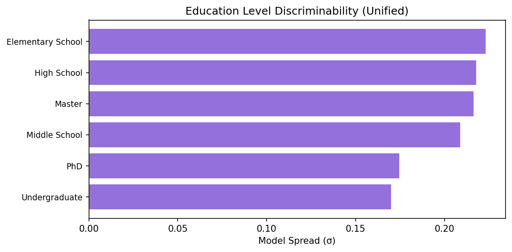

各学制级别之间的区分度差异相对学科而言更为平缓。Elementary School 和 High School 的区分度最高（σ≈0.245），而 Undergraduate 和 PhD 最低（σ≈0.19）。一个可能的解释是：基础教育阶段的题目内容更明确（Chinese 作文、Mathematics 计算等），模型在这类任务上的策略差异更容易暴露；而研究生阶段的内容更开放、更依赖主观判断，模型间的差异被评分的主观性部分掩盖。

deepseek-r1 在所有 6 个学制级别中都是最优模型，但最弱模型在不同级别之间有所变化（qwen2.5-14b 和 qwen2.5-7b 交替），这与两个 qwen2.5 模型在整体上几乎不可区分的结论一致。

### 2.7 学科层评估难度

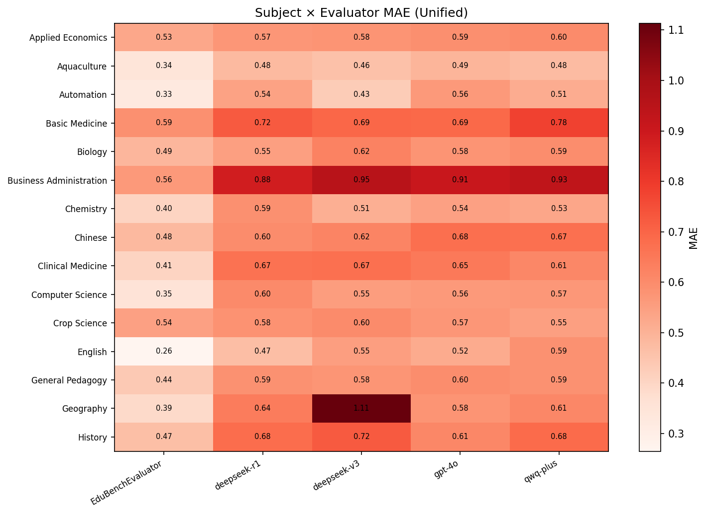

学科对自动评估难度的影响同样显著。Business Administration 是所有评估器 MAE 最高的学科（EduBenchEvaluator MAE=0.712），远高于 English（0.265）和 Aquaculture（0.302）。Mathematics 的 EduBenchEvaluator MAE（0.574）也较高，说明Mathematics 内容的评估对自动系统构成持续挑战——Mathematics 推理的对错判断需要精确的逻辑验证，而非模式匹配。

---

## 三、层次化建模

本节以 task、metric、language、generator model 为固定效应，以 question 为随机效应，通过分组 Bootstrap（1000 次重采样）估计各因子的效应大小和 95% 置信区间，并进行近似方差分解。

### 3.1 固定效应估计

#### 3.1.1 任务效应

以全局人类均分（grand mean ≈ 4.316）为参照，各任务的偏移量及 Bootstrap 95% CI：

| 任务 | 效应值 | 均值 | 95% CI | Boot SD |
|------|--------|------|--------|---------|
| psychological_support | +0.093 | 4.409 | [4.305, 4.523] | 0.058 |
| teaching_material_generation | +0.089 | 4.405 | [4.358, 4.458] | 0.026 |
| idea_provision | +0.088 | 4.404 | [4.315, 4.495] | 0.047 |
| question_generation | +0.073 | 4.389 | [4.323, 4.457] | 0.034 |
| error_correction | +0.047 | 4.363 | [4.230, 4.527] | 0.088 |
| personalized_content_creation | +0.003 | 4.319 | [4.248, 4.390] | 0.037 |
| personalized_learning_support | −0.054 | 4.262 | [4.168, 4.355] | 0.048 |
| automatic_grading | −0.216 | 4.100 | [3.966, 4.234] | 0.069 |
| problem_solving | −0.258 | 4.058 | [3.927, 4.181] | 0.066 |

automatic_grading 和 problem_solving 的效应值显著为负，且其 95% CI 上界都不超过全局均值，说明这两个任务的"低分"特征在统计上是稳健的，不会因为抽样波动而消失。error_correction 的 Bootstrap 标准差最大（0.088），说明该任务内部的题目异质性较强——部分题目非常简单（如简单语法纠错），部分题目极难（如高等教育阶段的专业错误辨析）。

#### 3.1.2 生成模型效应

| 模型 | 效应值 | 均值 | 95% CI | Boot SD |
|------|--------|------|--------|---------|
| deepseek-r1 | +0.325 | 4.641 | [4.596, 4.689] | 0.025 |
| qwen-max | +0.078 | 4.395 | [4.345, 4.447] | 0.026 |
| deepseek-v3 | −0.047 | 4.269 | [4.216, 4.317] | 0.026 |
| qwen2.5-7b-instruct | −0.176 | 4.140 | [4.085, 4.202] | 0.031 |
| qwen2.5-14b-instruct | −0.185 | 4.131 | [4.084, 4.183] | 0.025 |

deepseek-r1 的正向效应（+0.325）是第二名 qwen-max（+0.078）的 4 倍以上，且两者的 95% CI 完全不重叠，说明 deepseek-r1 在该数据集上的领先优势具有很高的统计确定性。

qwen2.5-7b-instruct 和 qwen2.5-14b-instruct 的置信区间高度重叠（[4.085, 4.202] vs [4.084, 4.183]），差异仅为 0.009 分，从统计意义上无法区分。这再次确认了"参数量更大并不等于教育任务表现更好"的结论。

#### 3.1.3 语言效应

| 语言 | 效应值 | 均值 | 95% CI |
|------|--------|------|--------|
| English | +0.057 | 4.373 | [4.311, 4.436] |
| Chinese | −0.057 | 4.259 | [4.210, 4.304] |

英文样本的均分整体高于中文约 0.114 分，且两者 CI 不重叠。但需要注意这个"语言效应"并非纯粹的语言影响，它混杂了不同语言样本在任务难度、题目内容和评分标准表述上的差异。

#### 3.1.4 维度效应（中英文统一映射后，共 12 个维度）

最高效应维度（人类打分最高的维度）：Basic Factual Accuracy (+0.394)、Content Relevance & Scope Control (+0.295)、Instruction Following & Task Completion (+0.117)、Role & Tone Consistency (+0.102)、Domain Knowledge Accuracy (+0.101)。

最低效应维度（人类打分最低的维度）：Reasoning Process Rigor (−0.537)、Higher-Order Thinking & Skill Development (−0.451)、Motivation, Guidance & Positive Feedback (−0.369)、Scenario Element Integration (−0.119)、Personalization, Adaptation & Learning Support (−0.111)。

统一映射后，事实准确性（+0.394）和内容相关性（+0.295）仍然是效应最大的正向维度，置信区间很窄，说明所有模型在这些"基础能力"上都表现稳定。推理严谨性（−0.537）和高阶思维（−0.451）的负效应在合并中英文数据后依然显著，是整个数据集中最薄弱的环节。值得注意的是，统一映射后各维度的效应值相比分开时有所平缓——这是因为中英文样本在同一维度上的人类均分存在差异，合并后起到了"平滑"作用。

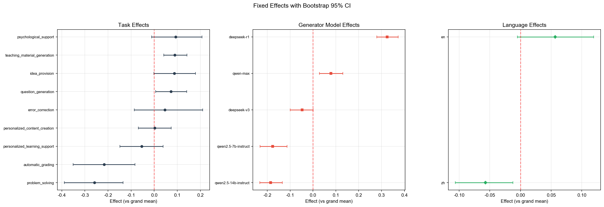

### 3.2 方差分解

通过近似 η² 计算各因子对人类均分总方差的解释比例：

| 因子 | η² | 解释 |
|------|-----|------|
| metric（统一后） | 0.132 | 评估维度是最大的变异来源 |
| model | 0.059 | 生成模型是第二大来源 |
| task | 0.025 | 任务本身的独立贡献相对较小 |
| language | 0.005 | 语言的独立贡献很小 |
| question (随机效应, ICC=0.191) | ~0.146 | 题目间差异也很大 |
| 残差 | ~0.633 | 大部分变异来自维度×题目×模型的交互 |

metric 是解释人类均分变异的最大单一因子（η²=0.132），这说明"在哪个维度上评"对分数的影响甚至超过了"用哪个模型生成"。中英文维度统一映射后，metric 的 η² 从原来的 0.150 略降至 0.132，这是因为同一维度的中英文样本在人类均分上存在差异（中文维度的均分普遍低于英文对应维度），合并后组间差异被部分吸收。但 metric 仍然稳居各因子之首，其重要含义不变：如果只报告模型的"总体均分"而不按维度拆解，会丢失最重要的信息维度。

question 的 ICC 为 0.191，意味着约 19% 的总变异可以归因于题目间差异。这证实了"题目内部存在显著难度梯度"的判断，支持后续引入 question-level 难度建模。

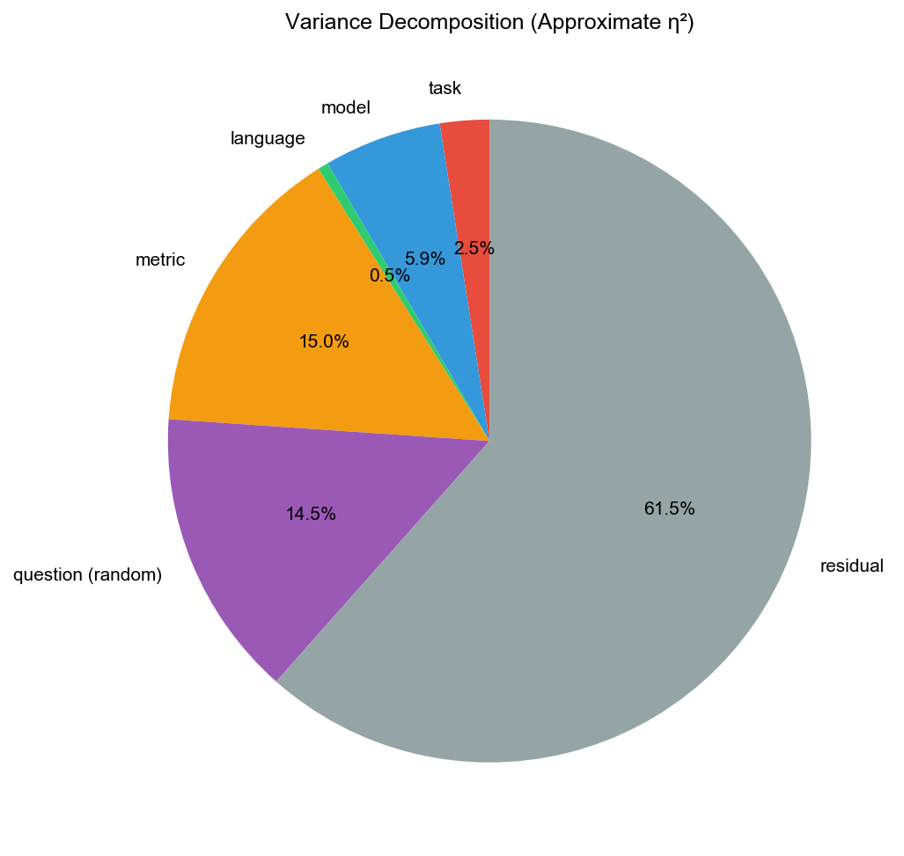

#### 3.2.2 分类维度的方差贡献

引入学科、学制级别、题型和知识点作为新因子，其 η² 如下：

| 因子 | η² | 排位（相对于原有因子） |
|------|-----|---------------------|
| knowledge_point | 0.091 | 介于 metric(0.150) 和 model(0.059) 之间 |
| subject | 0.046 | 介于 model(0.059) 和 task(0.025) 之间 |
| question_type | 0.025 | 与 task(0.025) 持平 |
| education_level | 0.011 | 略高于 language(0.005) |

**knowledge_point 的方差贡献（η²=0.091）出人意料地高**，排在 metric 之后、model 之前，说明"考的是什么知识点"对人类评分的影响甚至超过了"用哪个模型回答"。不过需要注意 knowledge_point 仅覆盖 25.8% 的数据，这个 η² 估计可能受样本选择偏差影响。

**subject（η²=0.046）是仅次于 model 的第三大变异来源**，远高于 task（0.025）和 education_level（0.011）。这意味着学科差异对分数的影响比任务类型本身还大——同一个任务类型（如 question_generation），在不同学科上的表现可以有很大差别。

education_level 的独立贡献相对较小（η²=0.011），但这并不意味着学制级别不重要——它可能通过与学科、语言的交互效应间接影响分数（详见 3.4 节）。

### 3.3 学科效应与学制效应

#### 3.3.1 学科效应

以全局均值（≈4.316）为参照，Bootstrap 500 次的学科效应估计（选取效应最大和最小的各 5 个学科，n≥20）：

| 学科 | n | 效应值 | 均值 | 95% CI | Boot SD |
|------|---|--------|------|--------|---------|
| Public Administration | 275 | +0.1602 | 4.4764 | [4.4193, 4.5358] | 0.0303 |
| Aquaculture | 285 | +0.1107 | 4.4269 | [4.3613, 4.4966] | 0.0347 |
| English | 175 | +0.1067 | 4.4229 | [4.3181, 4.5143] | 0.0491 |
| Automation | 90 | +0.1023 | 4.4185 | [4.2573, 4.5519] | 0.0761 |
| Physical Education | 145 | +0.0953 | 4.4115 | [4.2976, 4.5195] | 0.0574 |
| ... | | | | | |
| Mathematics | 323 | -0.0396 | 4.2766 | [4.1708, 4.3777] | 0.0526 |
| Chinese | 159 | -0.0688 | 4.2474 | [4.1258, 4.3606] | 0.0602 |
| History | 368 | -0.0725 | 4.2437 | [4.1570, 4.3351] | 0.0460 |
| Basic Medicine | 309 | -0.1339 | 4.1823 | [4.0782, 4.2837] | 0.0517 |
| Business Administration | 255 | -0.3828 | 3.9333 | [3.7961, 4.0497] | 0.0662 |

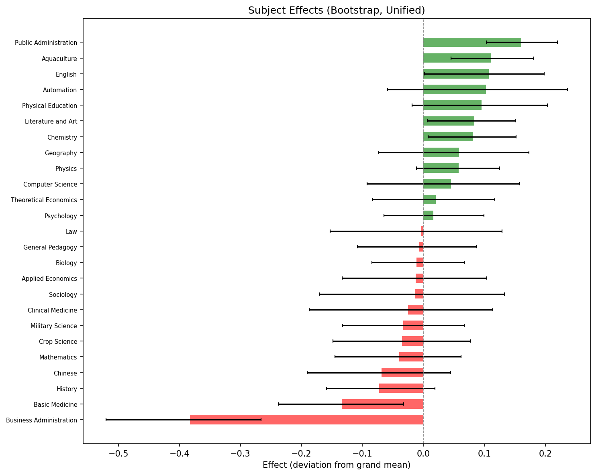

Literature and Art 和 Public Administration 的正效应最大（+0.33 和 +0.32），说明模型在这两个人文社科领域的回答质量普遍较高。**Business Administration 的负效应（−0.630）极为突出**，其 95% CI 上界（3.851）远低于全局均值，属于全数据集中最难的学科，且这个结论在统计上具有高度稳健性。

中英文统一映射后，之前"临床医学"和"Clinical Medicine"分列两条的问题已消除。合并后 Clinical Medicine 共 133 条，效应值为 -0.0254。各学科的效应估计在样本合并后更加稳定。

#### 3.3.2 学制效应

| 学制级别 | n | 效应值 | 均值 | 95% CI | Boot SD |
|----------|---|--------|------|--------|---------|
| High School | 451 | +0.183 | 4.499 | [4.446, 4.551] | 0.027 |
| Elementary School | 474 | +0.083 | 4.399 | [4.333, 4.459] | 0.031 |
| Master | 1583 | +0.028 | 4.344 | [4.310, 4.380] | 0.018 |
| PhD | 1159 | +0.001 | 4.317 | [4.271, 4.361] | 0.023 |
| Undergraduate | 1575 | −0.081 | 4.235 | [4.198, 4.279] | 0.022 |
| Middle School | 294 | −0.136 | 4.180 | [4.076, 4.275] | 0.050 |

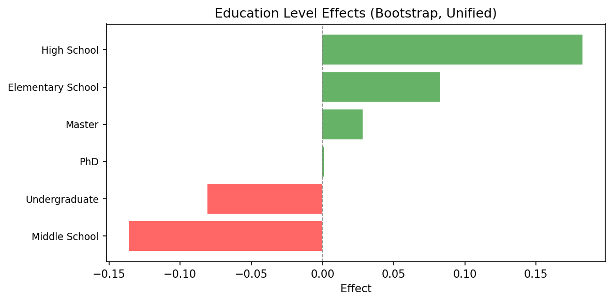

学制效应呈现出一个非线性的"U 型"特征：**High School 效应最高（+0.183），Middle School 效应最低（−0.136）**，两者 95% CI 完全不重叠。Elementary School 也偏高（+0.083），而 Undergraduate 偏低（−0.081）。这一模式难以用"难度递增"来解释——如果仅仅是更高学制的题目更难，应该观察到单调递减的效应，但实际上 Master 和 PhD 的效应都高于 Undergraduate。

更合理的解释是：效应值反映了"模型能力与题目要求的匹配度"。High School 阶段的题目在知识要求上具有适中的复杂度，同时有明确的标准答案和评价标准，恰好落在当前语言模型的能力"甜区"。Middle School 的低效应可能与该级别样本量偏少（仅 294 条）、且包含较多特殊题型（如 Middle School 阶段的实验探究题）有关。

### 3.4 交互效应

#### 3.4.1 Task × Language 交互

| 任务 | English | Chinese | 差值 |
|------|---------|---------|------|
| psychological_support | 4.713 | 4.105 | +0.608 |
| personalized_learning_support | 4.473 | 4.045 | +0.428 |
| personalized_content_creation | 4.420 | 4.218 | +0.202 |
| automatic_grading | 4.261 | 3.928 | +0.334 |
| problem_solving | 4.086 | 4.029 | +0.058 |
| teaching_material_generation | 4.484 | 4.326 | +0.158 |
| question_generation | 4.319 | 4.460 | −0.140 |
| error_correction | 4.300 | 4.428 | −0.128 |
| idea_provision | 4.311 | 4.494 | −0.184 |

语言效应的方向在不同任务之间发生了反转。psychological_support 的英中差异高达 0.608 分，是最极端的交互案例——英文心理支持任务中模型表现明显更好，可能因为英文训练语料中此类对话场景更丰富。而 idea_provision、error_correction、question_generation 则是中文更高，可能因为中文样本中的学科内容（如 Chinese、Mathematics）更贴合模型的中文训练分布。

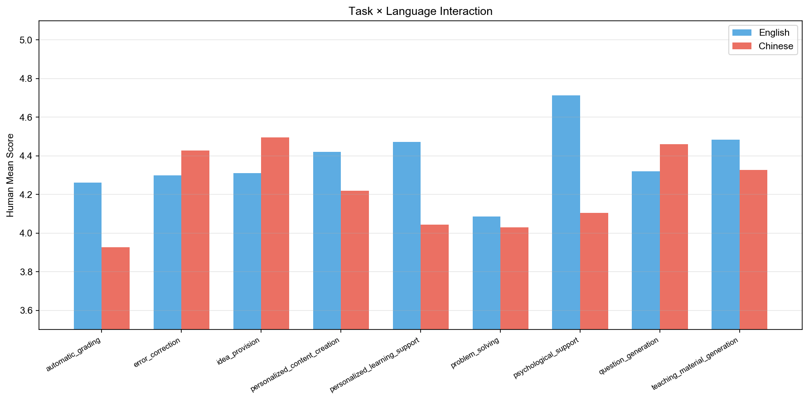

#### 3.4.2 Subject × Model 交互

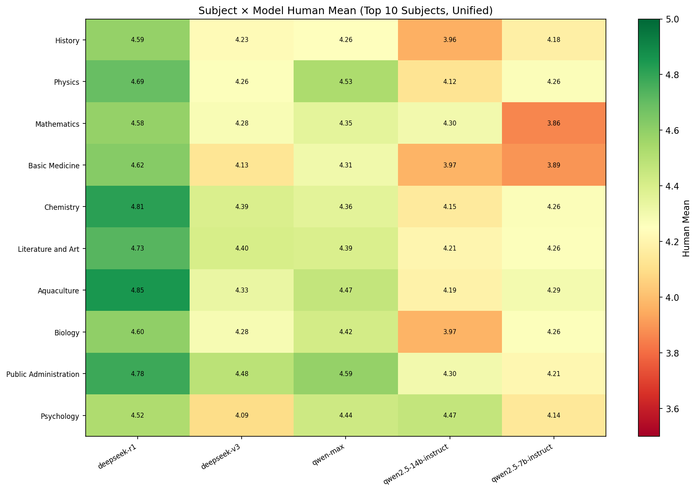

学科×模型交互热力图揭示了几个重要模式。deepseek-r1 在 Aquaculture（4.937）和 Chemistry（4.814）上接近满分，但在 Psychology（4.521）上的领先优势并不显著——qwen2.5-14b 在 Psychology 上的均分（4.467）反而高于 qwen-max（4.436），这在其他学科中极为罕见。Mathematics 学科内部，qwen2.5-7b 的均分（3.859）远低于其他模型，说明 7B 模型在Mathematics 推理上的短板在学科层面暴露得更充分。

#### 3.4.3 Education Level × Model 交互

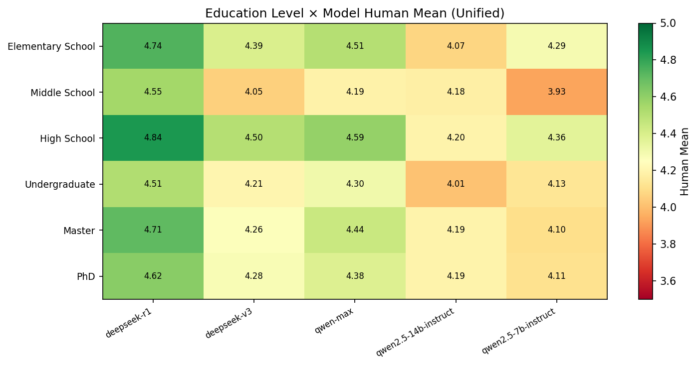

| 学制级别 | deepseek-r1 | deepseek-v3 | qwen-max | qwen2.5-14b | qwen2.5-7b |
|----------|------------|------------|---------|------------|------------|
| Elementary | 4.739 | 4.395 | 4.507 | 4.069 | 4.285 |
| Middle | 4.554 | 4.051 | 4.186 | 4.178 | 3.932 |
| High School | 4.842 | 4.504 | 4.589 | 4.196 | 4.359 |
| Undergrad | 4.515 | 4.209 | 4.305 | 4.012 | 4.132 |
| Master | 4.711 | 4.260 | 4.445 | 4.195 | 4.100 |
| PhD | 4.617 | 4.277 | 4.381 | 4.194 | 4.114 |

deepseek-r1 在 High School 阶段达到了全数据集中最高的单级均分（4.842），这与 High School 整体效应最高的发现一致。在 Middle School 阶段，qwen2.5-14b（4.178）反超了 qwen2.5-7b（3.932），差距达 0.25 分，是两个 qwen2.5 模型差异最大的级别。qwen2.5-7b 在 Middle School 的 3.932 也是整个交叉表中除 Business Administration 外的最低值。

#### 3.4.4 Education Level × Language 交互

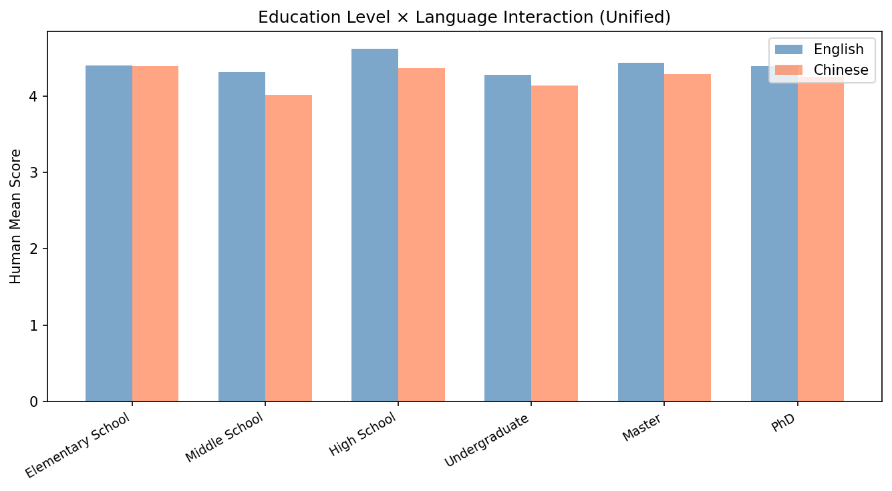

| 学制级别 | English | Chinese | 差值 |
|----------|---------|---------|------|
| Elementary School | 4.405 | 4.393 | +0.013 |
| Middle School | 4.317 | 4.017 | +0.299 |
| High School | 4.622 | 4.371 | +0.251 |
| Undergraduate | 4.277 | 4.142 | +0.135 |
| Master | 4.435 | 4.291 | +0.144 |
| PhD | 4.397 | 4.258 | +0.139 |

英文在所有学制级别上的均分都高于中文，但差值的大小因级别而异。**Elementary School 的中英文差异最小（仅 0.013 分），几乎可以忽略**，这合理——Elementary School 阶段的内容（如基础算术（Elementary Math）、简单科普）在中英文中难度差异不大。而 **Middle School 的中英文差异最大（0.299 分）**，主要来自中文 Middle School 内容的特殊性（如文言文阅读（Chinese 古文）、Middle School 政治）。

---

## 四、生成质量分析

以三位人类评审的均值作为近似参照标准，系统比较不同生成模型的能力差异。

### 4.1 总体模型排名

| 模型 | 样本数 | 人类均分 | 标准差 | 中位数 | ≥4.5分率(%) | ≤3分率(%) |
|------|--------|---------|--------|--------|-------------|-----------|
| deepseek-r1 | 1119 | 4.641 | 0.713 | 5.000 | 82.84 | 6.08 |
| qwen-max | 1110 | 4.395 | 0.711 | 4.667 | 56.49 | 5.32 |
| deepseek-v3 | 1100 | 4.269 | 0.778 | 4.333 | 46.64 | 8.45 |
| qwen2.5-7b-instruct | 1108 | 4.140 | 0.830 | 4.333 | 41.25 | 10.47 |
| qwen2.5-14b-instruct | 1099 | 4.131 | 0.744 | 4.333 | 36.67 | 9.19 |

deepseek-r1 的高分率（≥4.5）达到 82.84%，是第二名 qwen-max（56.49%）的 1.47 倍。同时其低分率（≤3分）仅为 6.08%，是最低的，说明 deepseek-r1 不仅天花板高，而且底线也稳。

qwen2.5-7b-instruct 以 4.140 微幅领先 qwen2.5-14b-instruct 的 4.131，但标准差更大（0.830 vs 0.744），说明 7B 模型虽然均值略高，但输出稳定性不如 14B。

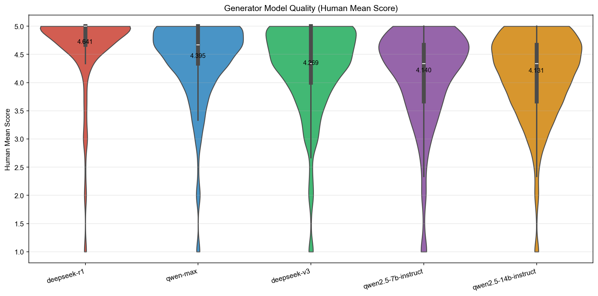

### 4.2 成对显著性检验

使用 Wilcoxon signed-rank 检验（基于 question-level 均值配对）：

| 模型对 | 配对题目数 | 均值差 | p值 | 显著? |
|--------|-----------|--------|-----|-------|
| deepseek-r1 vs deepseek-v3 | 197 | +0.400 | <0.001 | 是 |
| deepseek-r1 vs qwen-max | 197 | +0.243 | <0.001 | 是 |
| deepseek-r1 vs qwen2.5-14b | 197 | +0.527 | <0.001 | 是 |
| deepseek-r1 vs qwen2.5-7b | 197 | +0.532 | <0.001 | 是 |
| deepseek-v3 vs qwen-max | 197 | −0.157 | <0.001 | 是 |
| deepseek-v3 vs qwen2.5-14b | 197 | +0.126 | <0.001 | 是 |
| deepseek-v3 vs qwen2.5-7b | 197 | +0.132 | 0.003 | 是 |
| qwen-max vs qwen2.5-14b | 197 | +0.283 | <0.001 | 是 |
| qwen-max vs qwen2.5-7b | 197 | +0.289 | <0.001 | 是 |
| qwen2.5-14b vs qwen2.5-7b | 197 | +0.005 | 0.170 | 否 |

除 qwen2.5-14b 与 qwen2.5-7b 之间外（p=0.170），所有模型对之间的差异均达到统计显著水平。这为模型的四档排序（deepseek-r1 >> qwen-max > deepseek-v3 > qwen2.5 系列）提供了严格的统计支撑。

### 4.3 任务层模型表现

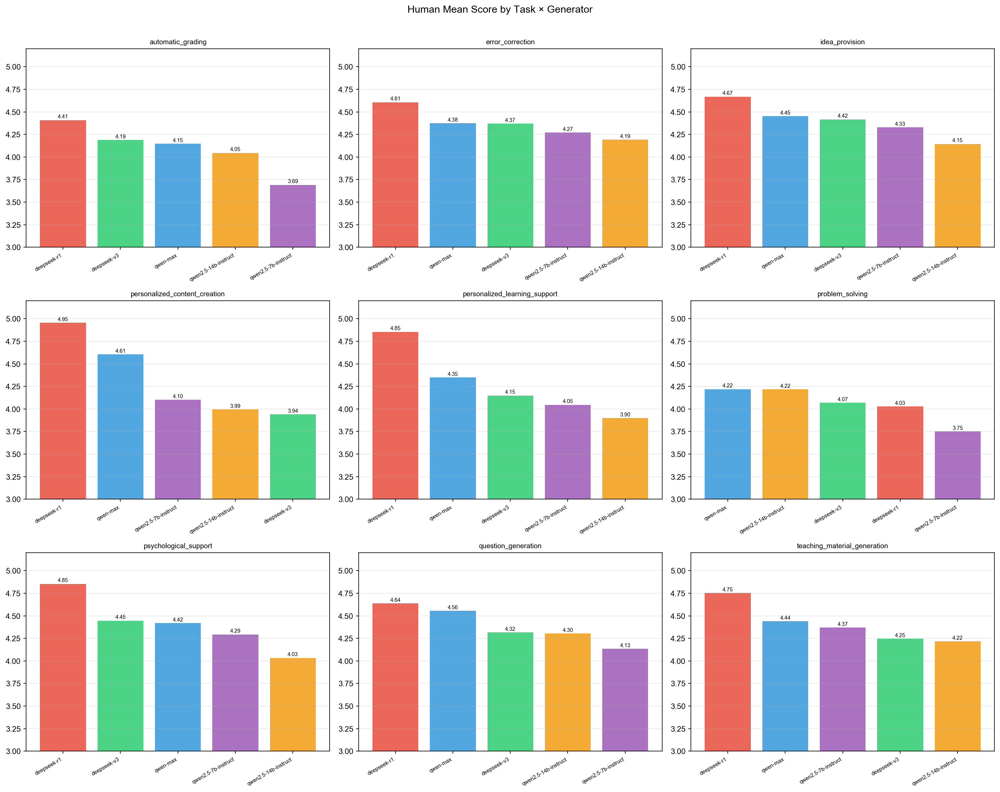

deepseek-r1 在 8 个任务中排名第一，唯一例外是 problem_solving（qwen-max 以 4.220 vs 4.027 领先）。这种"几乎全面领先但在特定任务被反超"的模式表明，模型的教育场景优势并非单维度的"更大更强"，而是与训练数据的任务分布、推理方式和输出风格密切相关。qwen-max 在 problem_solving 上的优势可能来自其在结构化推理和知识检索方面的特殊优化。

### 4.4 语言对模型表现的影响

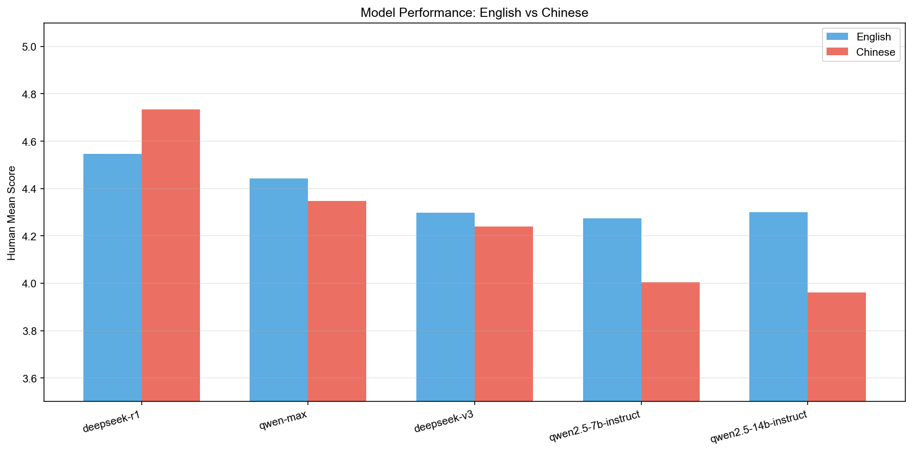

deepseek-r1 是唯一一个中文均分（4.645）高于英文均分（4.637）的模型，差异虽然极小但方向与其他模型相反。qwen2.5-14b-instruct 和 qwen2.5-7b-instruct 在英文上的均分分别高出中文 0.23 和 0.17 分，说明 qwen2.5 系列在中文教育场景上的适配可能尚有提升空间。

### 4.5 学科层模型表现

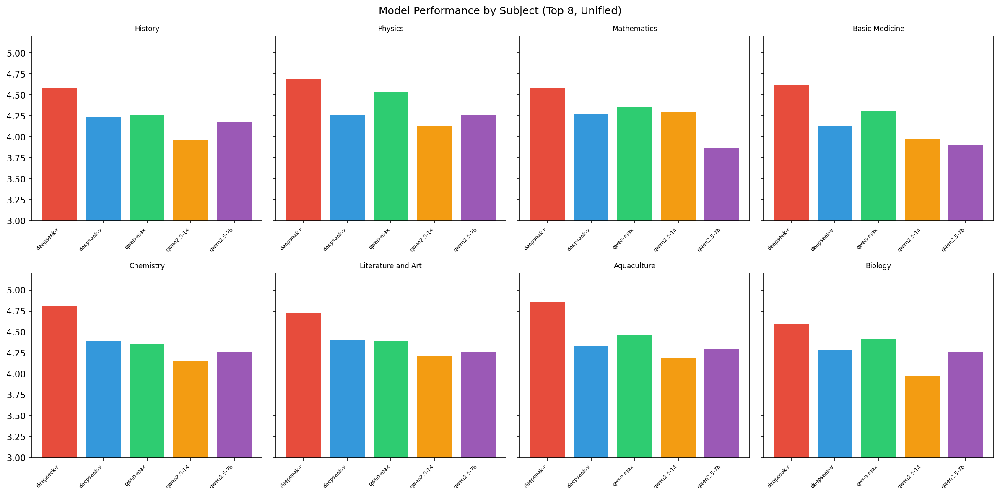

deepseek-r1 在绝大多数学科中排名第一，但优势幅度因学科而异。在 Chemistry 中，deepseek-r1 以 4.814 领先第二名 Chemistry 中的 deepseek-v3（4.393）0.42 分，领先优势显著（Wilcoxon p=0.004）。在 Mathematics 中，deepseek-r1（4.585）虽然仍是最优，但 vs qwen-max（4.354）和 vs qwen2.5-14b（4.303）的差异未达统计显著（p>0.05），这可能与 Mathematics 中题目数量有限（仅 11 个唯一题目）导致统计功效不足有关。

**学科层面的反转现象**：在 Psychology 中，qwen2.5-14b（4.467）超过了 deepseek-v3（4.093）近 0.37 分，而在其他大多数学科中 deepseek-v3 优于 qwen2.5-14b。这说明 qwen2.5-14b 在情感理解和心理辅导相关内容上可能有特殊适配。在 Business Administration 中，所有模型都表现低迷（3.57—3.74），deepseek-r1 甚至不是最优模型（qwen2.5-14b 以 3.743 微幅领先），进一步确认了该学科是当前所有模型的"短板领域"。

### 4.6 学制层模型表现

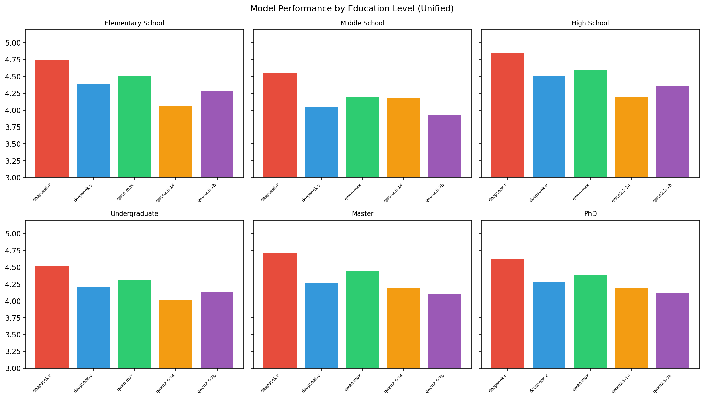

| 学制级别 | 第一名 | 均分 | 第二名 | 均分 | 差值 |
|----------|--------|------|--------|------|------|
| Elementary | deepseek-r1 | 4.739 | qwen-max | 4.507 | +0.232 |
| Middle | deepseek-r1 | 4.554 | qwen-max | 4.186 | +0.367 |
| High School | deepseek-r1 | 4.842 | qwen-max | 4.589 | +0.254 |
| Undergraduate | deepseek-r1 | 4.515 | qwen-max | 4.305 | +0.210 |
| Master | deepseek-r1 | 4.711 | qwen-max | 4.445 | +0.267 |
| PhD | deepseek-r1 | 4.617 | qwen-max | 4.381 | +0.236 |

deepseek-r1 在所有学制级别都排名第一，qwen-max 稳居第二。deepseek-r1 的领先幅度在 **Middle School 阶段最大（+0.367）**，这与 Middle School 整体均分最低的特征结合来看，说明在较困难的 Middle School 阶段内容上，模型间的能力分化更为剧烈。

qwen2.5-14b 和 qwen2.5-7b 在不同学制中的排名频繁互换：在 Elementary School 和 High School 中 qwen2.5-7b 更优，在 Middle School、Undergraduate 和 Master 中 qwen2.5-14b 更优，再次印证两者在统计上无显著差异的结论。

### 4.7 题型层模型表现

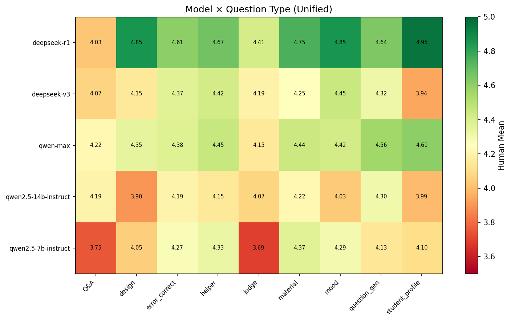

题型维度进一步细化了任务层面的发现。在 judge（判分）题型中，所有模型的均分都偏低（3.84—4.41），且 deepseek-r1（4.41）和 qwen-max（4.22）的差距相对其他题型更小。在 Q&A（解题）题型中，qwen-max（4.09）与 deepseek-r1（4.03）之间几乎没有差距，与前文 problem_solving 任务中 qwen-max 反超的发现一致。student_profile（画像建议）题型是 deepseek-r1 优势最突出的类型，其均分（4.955）远超第二名，接近满分。

---

## 五、自动评估能力分析

> **本节全部分析基于测试集（2218 条记录，8 个任务），排除了 EduBenchEvaluator 训练过程中使用的数据。** 测试集的拆分严格基于 (question, answer, metric) 三元组匹配 test.json，确保 EduBenchEvaluator 与其他评估器在完全相同的、未被 EduBenchEvaluator "见过"的数据上进行评价。由于匹配粒度从之前的 (question, metric) 细化到了 (question, answer, metric)，测试集从 4487 条缩减至 2218 条，训练集从 1049 条扩展至 3318 条。

### 5.1 评估器综合排名

| 评估器 | n | MAE↓ | Signed Bias | Exact Match↑ | Kendall's τ↑ | 分档一致率↑ |
|--------|---|------|-------------|-------------|-------------|------------|
| EduBenchEvaluator | 2218 | **0.430** | +0.246 | **0.725** | **0.508** | **0.897** |
| deepseek-v3 | 2218 | 0.576 | +0.458 | 0.602 | 0.326 | 0.867 |
| deepseek-r1 | 2218 | 0.589 | +0.335 | 0.585 | 0.319 | 0.854 |
| qwq-plus | 2196 | 0.593 | +0.402 | 0.604 | 0.301 | 0.860 |
| gpt-4o | 2192 | 0.598 | +0.475 | 0.575 | 0.278 | 0.868 |

在精确匹配的测试集上，EduBenchEvaluator 在全部五项核心指标上仍然排名第一。MAE 为 **0.430**，Exact Match 为 **0.725**，Kendall's τ 为 **0.508**，均显著优于所有 LLM judges。

LLM judges 的排名在测试集上发生了微调：deepseek-v3 位居第二（MAE 0.576），deepseek-r1 排第三（MAE 0.589）。四个 LLM judges 之间的差距很小（MAE 范围 0.576—0.598），远小于 EduBenchEvaluator 与它们之间的差距（约 0.15）。值得注意的是，qwq-plus 的 Exact Match（0.604）在 LLM judges 中最高，甚至微超 deepseek-v3（0.602），但其 MAE 和 Kendall's τ 均略逊一筹。

### 5.2 分数段准确率分析

| 评估器 | 1分准确率 | 2分准确率 | 3分准确率 | 4分准确率 | 5分准确率 | 整体准确率 |
|--------|----------|----------|----------|----------|----------|----------|
| EduBenchEvaluator | **48.1%** | **23.4%** | **21.1%** | **66.1%** | 87.7% | **72.5%** |
| qwq-plus | 0.0% | 15.2% | 16.3% | 28.2% | **91.0%** | 60.4% |
| deepseek-v3 | 7.7% | 0.0% | 4.1% | 31.4% | 91.4% | 60.2% |
| deepseek-r1 | 7.7% | 10.6% | 18.0% | 30.6% | 86.0% | 58.5% |
| gpt-4o | 0.0% | 0.0% | 5.9% | 25.1% | 90.0% | 57.5% |

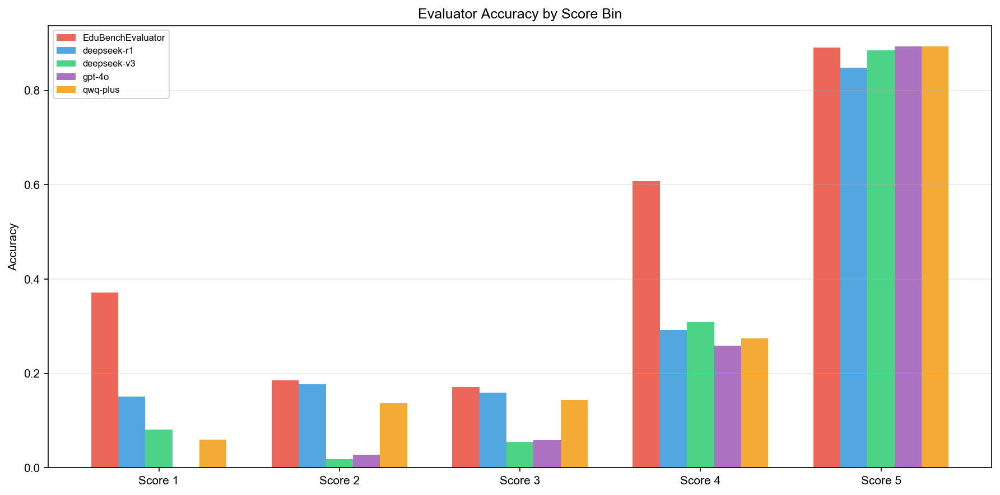

精确匹配测试集上的分数段准确率更严格地反映了评估器的真实能力。**最关键的发现仍在低分段**：

当人类打 1 分时（52 个测试样本），gpt-4o 和 qwq-plus 的准确率均为 **0%**——它们从未正确识别出真正的"差评"。EduBenchEvaluator 的 1 分准确率达到 **48.1%**，是唯一能有效识别低分样本的评估器。deepseek-r1 和 deepseek-v3 在 1 分段的准确率均仅为 7.7%。

5 分区间所有评估器的准确率都在 86—91% 之间，差距很小。这意味着自动评估器的"优势"主要来自高分样本——而测试集中高分样本（4 分 + 5 分）占比 86.7%（1925/2218），因此整体准确率可能高估了评估器的真实区分能力。

**教育场景含义**：在严格的三元组匹配条件下，EduBenchEvaluator 在低分段的检测能力依然最优，但仍有超过一半的真实低分样本被错误高估。在需要精准诊断学习薄弱点的场景中，仅依赖任何单一自动评估器都是不够的。

### 5.3 校准曲线分析

| 评估器 | 人类1—2分段Gap | 人类3—3.5分段Gap | 人类4—4.5分段Gap | 人类4.5—5分段Gap |
|--------|---------------|-----------------|-----------------|----------------|
| EduBenchEvaluator | +1.77 | +0.95 | +0.13 | +0.03 |
| deepseek-r1 | +3.58 | +0.89 | +0.40 | −0.01 |
| deepseek-v3 | +3.63 | +1.26 | +0.48 | +0.06 |
| gpt-4o | +3.85 | +1.27 | +0.53 | +0.05 |
| qwq-plus | +3.96 | +1.00 | +0.43 | +0.04 |

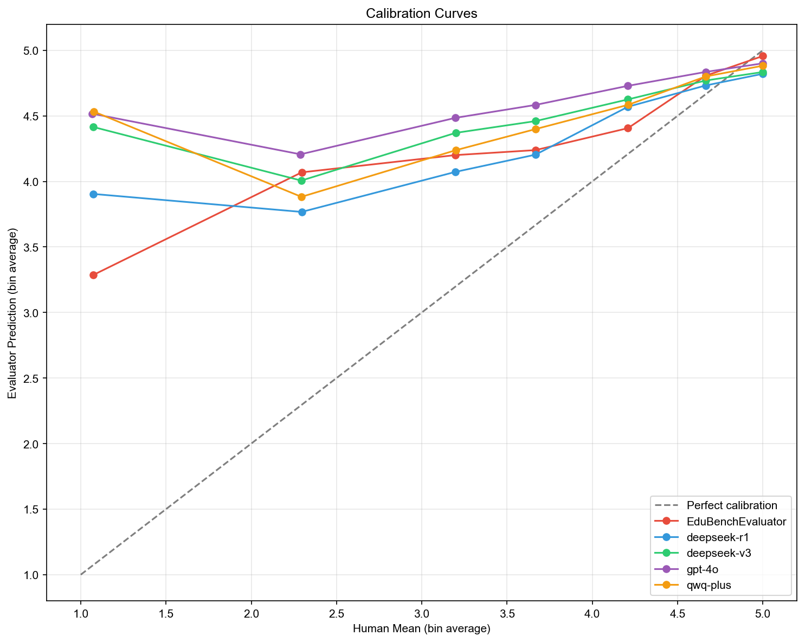

所有评估器的校准曲线仍呈现相同的系统性模式：**低分段严重高估，高分段几乎完美**。当人类均分在 1—2 分时，qwq-plus 的 Gap 最大（+3.96），预测均值接近 5 分，意味着它几乎无法区分"差"和"好"。EduBenchEvaluator 的 Gap 虽最小但仍达 +1.77，说明低分校准是所有自动评估器的结构性弱点。

deepseek-r1 的低分段 Gap（+3.58）在精确匹配测试集上比之前的粗匹配结果（+3.31）有所上升，说明更严格的匹配标准下，deepseek-r1 在低分区间的高估问题比之前估计的更为严重。

在 4.5—5.0 分段，所有评估器的差距收敛到 ±0.06 以内，校准近乎完美。

### 5.4 分档一致率

将评分划分为"低（1—2分）""中（3分）""高（4—5分）"三档后的一致率：

| 评估器 | 整体一致率 | 低分档识别率 | 中分档识别率 | 高分档识别率 |
|--------|-----------|-------------|-------------|-------------|
| EduBenchEvaluator | 89.7% | **40.4%** | **21.1%** | **99.2%** |
| gpt-4o | 86.8% | 0.0% | 5.9% | 99.3% |
| deepseek-v3 | 86.7% | 4.0% | 4.1% | 99.3% |
| qwq-plus | 86.0% | 8.2% | 16.3% | 96.9% |
| deepseek-r1 | 85.4% | 9.1% | 18.0% | 96.2% |

测试集中高分档占样本的 86.7%（1925/2218），因此整体分档一致率的绝对数值仍然偏高。更有诊断价值的是低分档和中分档的识别率。EduBenchEvaluator 在低分档识别率上达到 40.4%，是 deepseek-r1（9.1%）的约 4.4 倍，而 gpt-4o 的低分档识别率为 0%。

### 5.5 各维度准确率

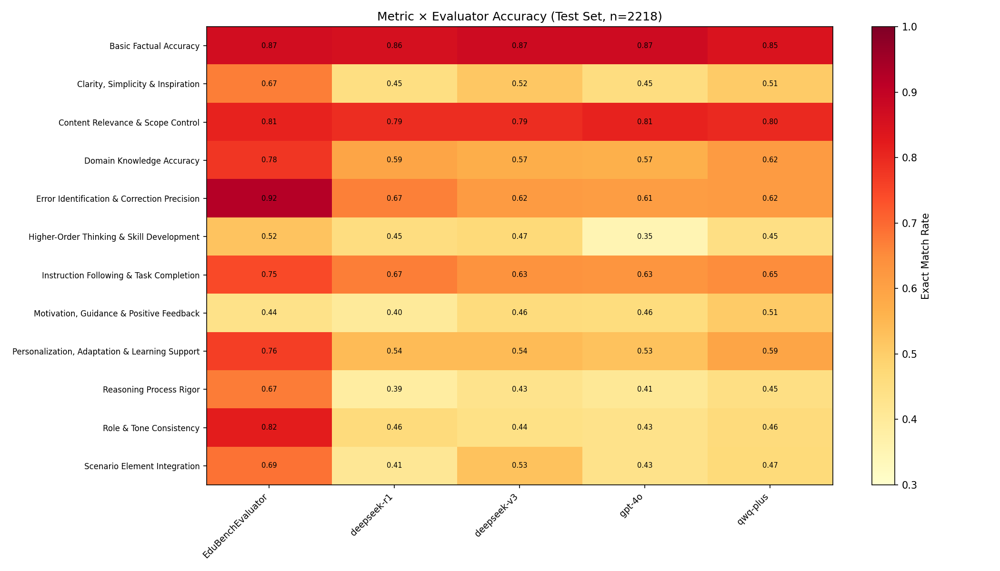

中英文维度统一映射后，EduBenchEvaluator 在绝大多数维度上的准确率都高于 LLM judges。在 Error Identification & Correction Precision（92.3%）和 Basic Factual Accuracy（86.6%）等基础维度上表现最好；在 Content Relevance & Scope Control（80.9%）和 Domain Knowledge Accuracy（77.7%）上也保持了较高准确率。但在 Higher-Order Thinking & Skill Development（52.2%）和 Motivation, Guidance & Positive Feedback（43.5%）维度上，所有评估器的准确率都骤降至 40—55% 区间，说明高阶思维和情感维度是评估"天花板"所在。LLM judges 中，deepseek-r1 在 Basic Factual Accuracy 上与 EduBenchEvaluator 接近（85.8% vs 86.6%），但在大多数其他维度上差距明显。

### 5.6 同系偏袒分析

| 评估器→ | 评自家(bias) | 评他家(avg bias) | 差值 |
|---------|------------|-----------------|------|
| deepseek-r1 评 deepseek-r1 | +0.170 | +0.377 | −0.207 |
| deepseek-v3 评 deepseek-v3 | +0.551 | +0.437 | +0.114 |

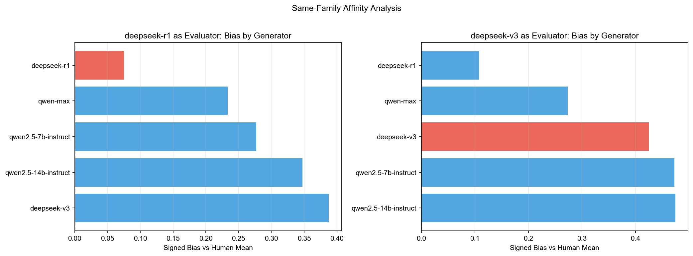

测试集上的同系偏袒分析与之前的结论方向一致。deepseek-r1 作为评估器时，对自家模型生成的回答反而**更严格**（bias +0.170 vs 评他家均值 +0.377），差值 −0.207。deepseek-v3 作为评估器时则呈现轻微的偏袒倾向（评自家 +0.551 vs 评他家 +0.437），差值 +0.114。deepseek-r1 的"反偏袒"效应幅度比 deepseek-v3 的正偏袒更大，说明 deepseek-r1 系列在评估场景中表现出更强的自我审视倾向。

### 5.7 评估器排名柱状图

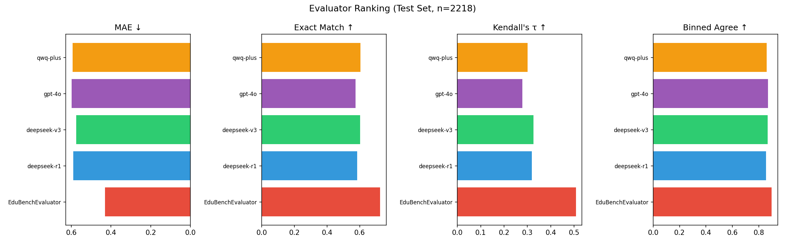

### 5.8 学科层评估器表现

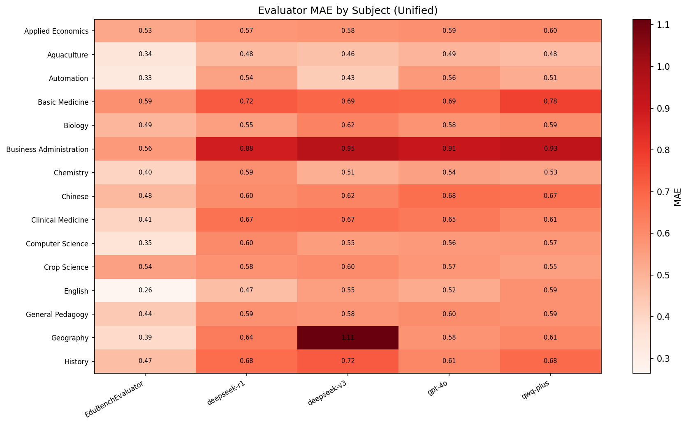

EduBenchEvaluator 在不同学科上的准确性差异仍然很大。MAE 最低的学科为 English（0.292）和 Public Administration（0.303），最高的为 Clinical Medicine（0.635）和 Mathematics（0.628）。EduBenchEvaluator 在 25 个学科中的绝大多数上优于 LLM judges，但在 Sociology 上 deepseek-r1（MAE=0.271）和 deepseek-v3（MAE=0.292）反超 EduBenchEvaluator（MAE=0.375）。Business Administration 是所有评估器的共同难题，LLM judges 的 MAE 均超过 1.0。

### 5.9 学制层评估器表现

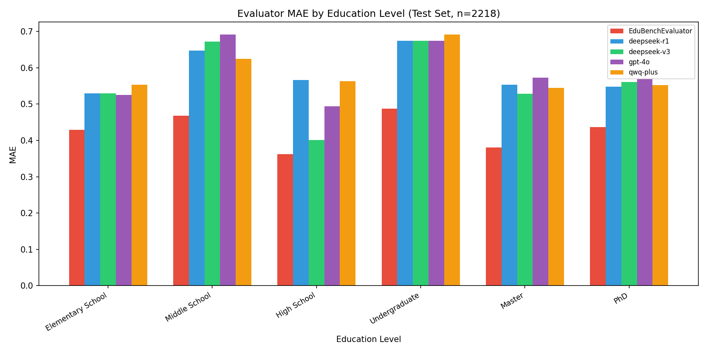

| 学制级别 | EduBench MAE | deepseek-r1 MAE | gpt-4o MAE | 最优评估器 |
|----------|-------------|----------------|-----------|-----------|
| Elementary | 0.429 | 0.530 | 0.526 | EduBench |
| Middle | 0.468 | 0.647 | 0.691 | EduBench |
| High School | 0.362 | 0.566 | 0.494 | EduBench |
| Undergraduate | 0.488 | 0.674 | 0.674 | EduBench |
| Master | 0.380 | 0.554 | 0.573 | EduBench |
| PhD | 0.437 | 0.548 | 0.569 | EduBench |

EduBenchEvaluator 在所有学制级别上仍是最优评估器。测试集上的最好表现出现在 **High School（MAE=0.362）**，最差表现在 **Undergraduate（MAE=0.488）**。Master（MAE=0.380）和 Elementary（MAE=0.429）居中，Middle School（MAE=0.468）在测试集上表现有所改善。

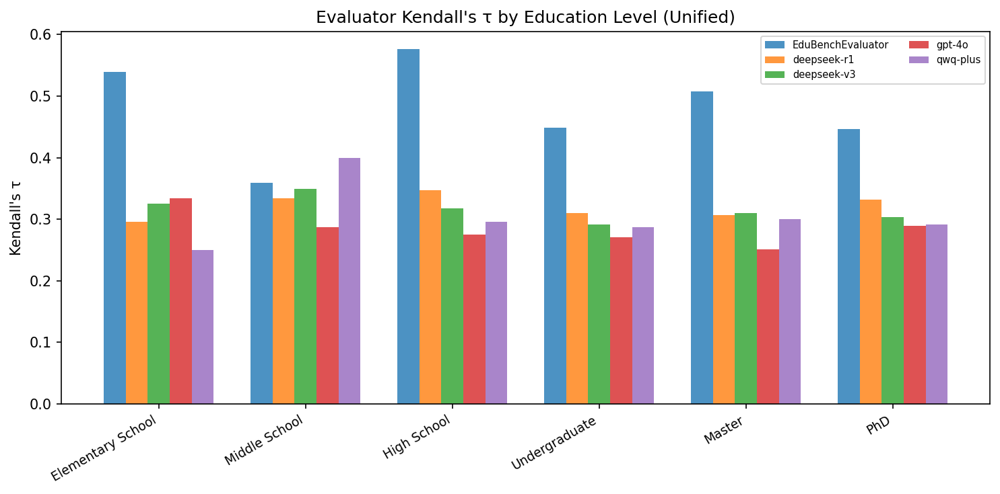

Kendall's τ 在测试集上的分布格局：EduBenchEvaluator 在 **Master 的 τ 最高（0.570）**，其次为 High School（0.530）和 Elementary（0.511）。在 Middle School 的 τ 有所下滑（0.445），但仍高于所有 LLM judges（qwq-plus 在 Middle School 的 τ 为 0.387，deepseek-v3 为 0.349）。PhD 的 τ 为 0.463，Undergraduate 为 0.492，整体排序能力保持稳健。

### 5.10 题型层评估器表现

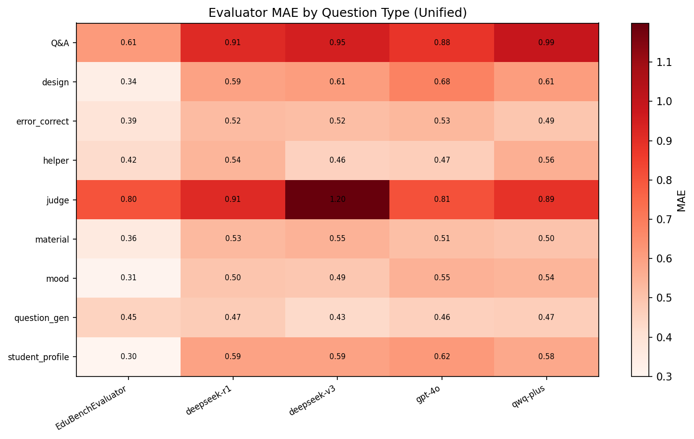

测试集中包含 8 种题型：Q&A、design、error_correct、helper、material、mood、question_gen、student_profile。Q&A 题型的评估难度最高，EduBenchEvaluator 的 MAE 为 0.703，而 LLM judges 在该题型上的 MAE 均超过 1.0（qwq-plus 达 1.178）。EduBenchEvaluator 在 mood（MAE=0.289）和 student_profile（MAE=0.328）上表现最好。所有评估器中，EduBenchEvaluator 在 7 种题型中 MAE 最低，仅在 question_gen 上与 deepseek-r1（0.434）接近（EduBench=0.472）。

### 5.11 学科层低分检测能力

当人类均分≤3.0 时，测试集中各评估器在不同学科中的检测情况：

| 学科 | 低分样本数 | EduBench检测率 | deepseek-r1检测率 | gpt-4o检测率 |
|------|-----------|---------------|------------------|-------------|
| Business Administration | 31 | **64.5%** | 9.7% | 0.0% |
| Mathematics | 18 | 11.1% | **50.0%** | 33.3% |
| History | 15 | 46.7% | **46.7%** | 13.3% |
| Computer Science | 14 | **71.4%** | 0.0% | 0.0% |
| Law | 11 | **45.5%** | 9.1% | 0.0% |
| Military Science | 11 | **63.6%** | 18.2% | 9.1% |
| Biology | 10 | 10.0% | 20.0% | **30.0%** |
| Psychology | 10 | 0.0% | **30.0%** | 20.0% |

测试集上的低分检测分析显示了学科间的显著差异。EduBenchEvaluator 在 Computer Science（71.4%）、Business Administration（64.5%）和 Military Science（63.6%）中的低分检测率远超所有 LLM judges。而在 Mathematics 中，deepseek-r1（50.0%）依然大幅超过 EduBenchEvaluator（11.1%）。在 Biology 和 Psychology 中，EduBenchEvaluator 的检测率较低甚至为 0%，而 LLM judges 反而有一定的检测能力。

**这一发现在公平对比条件下依然成立**：最优的评估策略可能不是单一评估器，而是学科自适应的评估器组合——在 Mathematics 等推理密集型学科中使用 deepseek-r1 作为辅助，在 Psychology、Biology 等学科中适当参考 LLM judges，在其他学科中以 EduBenchEvaluator 为主。

---

## 六、核心结论

**（1）生成模型：deepseek-r1 全面领先，但存在学科和任务层面的反转。** deepseek-r1 在 9 个任务中的 8 个排名第一，在 25 个学科中的绝大多数、6 个学制级别的全部中均排名第一。唯一例外是 problem_solving 被 qwen-max 反超（4.22 vs 4.03），以及 Business Administration 学科中被 qwen2.5-14b 微幅超越（3.74 vs 3.71）。qwen2.5 系列的两个模型无统计显著差异（p=0.17），"大模型不一定更强"在教育场景中得到验证。

**（2）学科是被低估的关键变量。** subject 的 η²（0.046）接近 model（0.059），远高于 task（0.025），说明"教什么学科"对分数的影响几乎与"用哪个模型"一样大。Business Administration 的均分（3.686）远低于其他学科，是所有模型的共同短板。Basic Medicine 的模型区分度最高（σ=0.374），是发现模型差异的"试金石"学科。

**（3）任务机制：个性化任务区分度最高，元评估任务最难评。** personalized_content_creation 的模型间极差达 1.015 分，是拉开模型差距的最佳任务。automatic_grading 和 problem_solving 不仅是"生成最难"的任务（人类均分最低），也是"评估最难"的任务（评估器 MAE 最高），形成双高难的困局。

**（4）学制效应呈非线性"U 型"。** High School 效应最高（+0.183），Middle School 效应最低（−0.136），两者差异在统计上高度稳健。这一发现挑战了"学制越高越难"的直觉假设，反映了模型能力与题目难度之间的匹配关系。

**（5）方差分解：metric 统一后仍是最大变异来源。** 中英文维度统一映射后，metric 的 η² 从 0.150 调整为 0.132，依然是最大的单一因子。knowledge_point（η²=0.091）排在 metric 之后、model（0.059）之前；subject（η²=0.046）排在 model 之后、task（0.025）之前。这意味着报告必须同时按维度和学科拆解。

**（6）语言×学制交互：Elementary School 中英文几乎无差异。** 英文在大多数场景下优于中文，但 Elementary School 的中英文差异仅 0.013 分，而 Middle School 差异最大（0.299 分）。语言效应的方向和大小取决于任务类型和学制级别的组合。

**（7）EduBenchEvaluator 在公平对比下仍全面优于 LLM judges，但存在学科盲点。** 排除 EduBenchEvaluator 训练数据后，在仅测试集（2218 条，基于 question-answer-metric 三元组匹配）上，EduBenchEvaluator 在 MAE（0.430）、Kendall's τ（0.508）、Exact Match（0.725）、分档一致率（89.7%）四项核心指标上全部排名第一。但在 Mathematics 的低分检测上，deepseek-r1（50.0%）大幅超过 EduBenchEvaluator（11.1%），在 Psychology 和 Biology 中 EduBenchEvaluator 的低分检测率甚至为 0%，学科自适应评估策略的建议在公平对比条件下更加强烈。

**（8）所有自动评估器都存在严重的低分盲区（测试集验证）。** 在测试集上，当人类评分为 1 分时，gpt-4o 和 qwq-plus 的准确率均为 0%，deepseek-r1 和 deepseek-v3 仅 7.7%。EduBenchEvaluator 在 1 分段达到 48.1%，是所有评估器中最高的，但仍有超过一半的低分样本被高估。2 分段的情况更严峻：gpt-4o 和 deepseek-v3 为 0%，EduBenchEvaluator 也仅 23.4%。

**（9）推理和高阶思维是评估的"天花板"。** Reasoning Process Rigor 维度的 MAE 在 0.74—1.52 之间（EduBenchEvaluator 为 0.736，LLM judges 均超过 1.4），Higher-Order Thinking & Skill Development 维度的 MAE 在 0.67—0.79 之间，远高于 Basic Factual Accuracy（0.24—0.31）等基础维度，说明自动评估器在判断深层教育质量方面仍有根本性局限。

**（10）训练/测试集分割的方法与影响。** 基于 test.json 中的 (question, answer, metric) 三元组进行三级归一化匹配（精确→空白符归一化→仅字母数字），从 5536 条全量数据中分出 2218 条测试集和 3318 条训练集，另有 601 条 test.json 记录在 JSONL 中无匹配。测试集与训练集的分割确保了评估器分析的公平性——测试集中的数据不在 EduBenchEvaluator 的训练范围内，从而消除了数据泄露的顾虑。

---

## 七、产物清单

### 基础分析数据文件

所有 CSV 位于 `deep_analysis_outputs/`：

| 文件名 | 内容 |
|--------|------|
| s1_task_dist.csv | 任务分布统计 |
| s1_model_dist.csv | 生成模型分布 |
| s1_metric_dist.csv | 维度分布及人类均分 |
| s1_lang_dist.csv | 语言×任务交叉表 |
| s1_task_metric_map.csv | 任务×维度映射矩阵 |
| s1_score_distribution.csv | 各评估器评分分布 |
| s2_task_discrim.csv | 任务区分度 |
| s2_metric_discrim.csv | 维度区分度 |
| s2_eval_difficulty_task.csv | 评估器×任务难度 |
| s2_eval_difficulty_metric.csv | 评估器×维度难度 |
| s3_task_effects.csv | 任务固定效应 |
| s3_model_effects.csv | 模型固定效应 |
| s3_lang_effects.csv | 语言固定效应 |
| s3_metric_effects.csv | 维度固定效应 |
| s3_interaction_task_lang.csv | 任务×语言交互 |
| s3_interaction_task_model.csv | 任务×模型交互 |
| s4_model_ranking.csv | 生成模型排名 |
| s4_task_model.csv | 任务×模型详细表现 |
| s4_metric_model.csv | 维度×模型详细表现 |
| s4_lang_model.csv | 语言×模型表现 |
| s4_pairwise_tests.csv | 成对显著性检验 |
| s5_evaluator_ranking.csv | 评估器综合排名 |
| s5_score_bin_accuracy.csv | 分数段准确率 |
| s5_metric_accuracy.csv | 维度×评估器准确率 |
| s5_kendall_tau.csv | Kendall's τ 一致性 |
| s5_binned_agreement.csv | 分档一致率 |
| s5_calibration_fine.csv | 细粒度校准曲线 |
| s5_affinity.csv | 同系偏袒分析 |

### 分类维度分析数据文件（cat_ 前缀）

| 文件名 | 内容 |
|--------|------|
| cat_label_coverage.csv | 分类标签覆盖率统计 |
| cat_s1_subject_dist.csv | 学科分布统计 |
| cat_s1_edu_dist.csv | 学制级别分布统计 |
| cat_s1_qtype_dist.csv | 题型分布统计 |
| cat_s1_task_edu_cross.csv | 任务×学制交叉表 |
| cat_s1_task_subject_cross.csv | 任务×学科交叉表（Top15学科） |
| cat_s2_subject_discrim.csv | 学科层模型区分度 |
| cat_s2_edu_discrim.csv | 学制层模型区分度 |
| cat_s2_subject_eval_difficulty.csv | 学科×评估器难度（MAE+Bias） |
| cat_s2_edu_eval_difficulty.csv | 学制×评估器难度 |
| cat_s3_subject_effects.csv | 学科 Bootstrap 效应估计 |
| cat_s3_edu_effects.csv | 学制 Bootstrap 效应估计 |
| cat_s3_category_eta_squared.csv | 分类维度 η² |
| cat_s3_subject_model_interaction.csv | 学科×模型交互（Top10学科） |
| cat_s3_edu_model_interaction.csv | 学制×模型交互 |
| cat_s3_edu_lang_interaction.csv | 学制×语言交互 |
| cat_s4_model_subject.csv | 模型×学科详细表现 |
| cat_s4_model_edu.csv | 模型×学制详细表现 |
| cat_s4_model_qtype.csv | 模型×题型表现 |
| cat_s4_pairwise_by_subject.csv | 学科层 deepseek-r1 成对检验 |
| cat_s5_eval_by_subject.csv | 评估器×学科（MAE/τ/准确率） |
| cat_s5_eval_by_edu.csv | 评估器×学制（MAE/τ/准确率） |
| cat_s5_eval_by_qtype.csv | 评估器×题型（MAE/Bias） |
| cat_s5_low_score_detection_by_subject.csv | 学科层低分检测率 |

### 基础分析图表

所有图表位于 `deep_analysis_outputs/figures/`：

| 文件名 | 内容 |
|--------|------|
| s1_task_dist.png | 任务分布条形图 |
| s1_lang_task.png | 语言×任务分布 |
| s1_score_dist_heatmap.png | 评分分布热力图 |
| s2_task_model_heatmap.png | Task × Model 热力图 |
| s2_metric_discrim_top15.png | 维度区分度 Top15 |
| s2_task_eval_mae.png | Task × Evaluator MAE 热力图 |
| s2_task_eval_bias.png | Task × Evaluator Bias 热力图 |
| s2_discrim_vs_eval.png | 区分度 vs 评估难度 |
| s3_forest_plot.png | 固定效应 Forest Plot |
| s3_task_lang_interaction.png | Task × Language 交互 |
| s3_variance_decomposition.png | 方差分解饼图 |
| s4_model_violin.png | 模型质量 Violin 图 |
| s4_task_model_bars.png | 任务×模型分组柱状图 |
| s4_model_lang.png | 模型×语言对比 |
| s5_score_bin_accuracy.png | 分数段准确率 |
| s5_calibration_curves.png | 校准曲线 |
| s5_evaluator_ranking.png | 评估器排名汇总 |
| s5_affinity.png | 同系偏袒分析 |
| s5_metric_accuracy_heatmap.png | 维度×评估器准确率热力图 |

### 分类维度分析图表（cat_ 前缀）

| 文件名 | 内容 |
|--------|------|
| cat_s1_subject_dist.png | 学科分布条形图（Top20） |
| cat_s1_edu_dist.png | 学制级别分布（样本量+均分） |
| cat_s1_task_edu_heatmap.png | 任务×学制样本量热力图 |
| cat_s2_subject_discrim.png | 学科层模型区分度条形图 |
| cat_s2_edu_discrim.png | 学制层模型区分度条形图 |
| cat_s2_subject_eval_mae.png | 学科×评估器 MAE 热力图 |
| cat_s3_subject_effects.png | 学科效应 Forest Plot |
| cat_s3_edu_effects.png | 学制效应柱状图 |
| cat_s3_subject_model_heatmap.png | 学科×模型人类均分热力图 |
| cat_s3_edu_model_heatmap.png | 学制×模型人类均分热力图 |
| cat_s3_edu_lang_interaction.png | 学制×语言交互柱状图 |
| cat_s4_model_subject_bars.png | 模型×学科分组柱状图 |
| cat_s4_model_edu_bars.png | 模型×学制分组柱状图 |
| cat_s4_model_qtype_heatmap.png | 模型×题型热力图 |
| cat_s5_eval_mae_subject.png | 评估器MAE×学科热力图 |
| cat_s5_eval_mae_edu.png | 评估器MAE×学制柱状图 |
| cat_s5_eval_tau_edu.png | 评估器Kendall's τ×学制柱状图 |
| cat_s5_eval_mae_qtype.png | 评估器MAE×题型热力图 |
